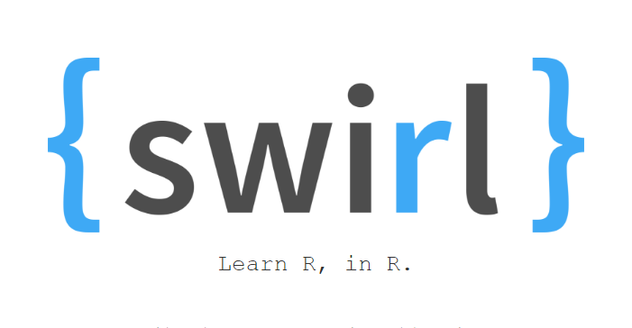

Sedang belajar R? Lupakan cara tradisional! Kini kita dapat belajar R
dengan swirl. Ya, `swirl` adalah *R package* untuk belajar statistika
sekaligus `R`. swirl mengubah *R console* menjadi sarana belajar yang
interaktif. Menggunakan swirl, kita dapat belajar *data science*,
statistika dan R secara mandiri, mudah dan menyenangkan. Pengguna akan
mendapatkan umpan-balik sesaat setelah mamasukan kode-kode R. Informasi
detail mengenai swirl dapat diperoleh di
[swirlstats.com](http://swirlstats.com/) atau di [halaman Github
ini](https://github.com/swirldev/swirl).

[](http://swirlstats.com/)

## Menginstal swirl

Cara paling mudah untuk menginstal swirl adalah melalui CRAN. Jalankan
perintah berikut pada *R console* :

```r
install.packages("swirl")
```

Atau, jika ingin menginstal versi *developer*-nya:

```r
install.packages("devtools")
library(devtools)
devtools::install_github("swirldev/swirl")
```

Panduan lebih lengkap tentang bagaimana menginstal *R package* bisa
dilihat pada artikel [Menginstal R
Package](http://nurandi.id/blog/menginstal-r-package/).

## Menginstal materi belajar

Materi belajar pada swirl harus diinstal secara terpisah. Caranya:

```r
library(swirl)
install_from_swirl("Nama Materi")
swirl()
```

Ganti `Nama Materi` dengan materi yang diinginkan. Sebagai contoh,
`install_from_swirl("R Programming")` akan menginstal materi untuk **R
Programming** (nama materi *case-sensitive*).

## Daftar materi yang disediakan

Berikut adalah daftar materi yang disediakan oleh swirl:

### Beginner

-   **R Programming**: dasar-dasar pemromgraman dalam R
-   **R Programming Alt**: sama seperti `R Programming`, tapi ada
    sedikit modifikasi
-   **Data Analysis**: Dasar-dasar analisis data
-   **Mathematical Biostatistics Boot Camp**: *t-test* dan *sampling*
-   **Open Intro**: Pengenalan statistika, analisis data dan visualisasi

### Intermediate

-   **Regression Models**: Model regresi menggunakan R
-   **Getting and Cleaning Data**: Data cleansing

### Advanced

-   **Statistical Inference**: Konsep dasar peluang (*probability*),
    pengujian hipotesis, selang kepercayaan (*confidence intervals*) dan
    nilai-*p* (*p-value*).

Selengkapnya bisa lihat repo [Github
ini](https://github.com/swirldev/swirl_courses/). Selamat mencoba :)
