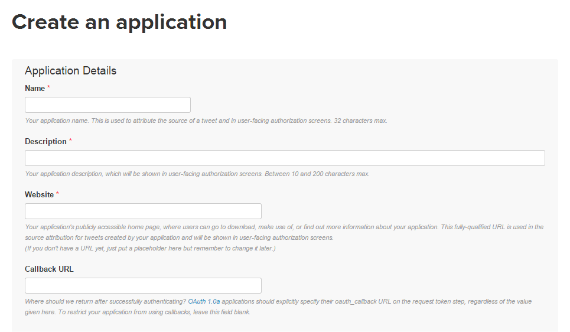
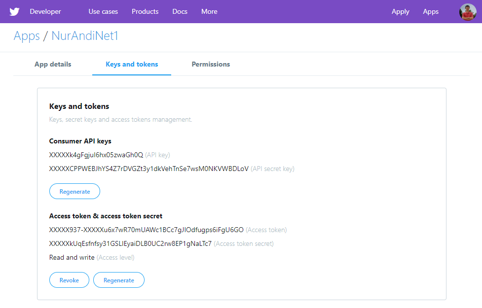

Menggunakan paket `twitteR`, R dapat digunakan untuk mengambil informasi
dari Twitter untuk keperluan analisis. *Thanks to
[geoffjentry](https://github.com/geoffjentry/twitteR) who created
[twitteR package](https://github.com/geoffjentry/twitteR) and make it
available for free*. Agar R dan Twitter terhubung dengan baik, terlebih
dahulu kita harus mendapatkan *authentication*. Berikut adalah proses
twitter *authentication* dengan R:

## Mendapatkan *API key* dan *access token*

Kita harus mempunyai *API key* dan *access token* dari Twitter. Caranya
sangat mudah. Kita hanya perlu membuat aplikasi pada Twitter.

-   Kunjungi <https://apps.twitter.com> dan login menggunakan akun
    Twitter
-   Lalu [Create New App](https://apps.twitter.com/app/new)
-   Isi form berikut. *Name* dan *Description* bisa diisi apa saja.
    Tulis URL untuk pada kolom *Website* diawali `http://` atau
    `https://`. Jika tidak punya website, isi dengan URL website apa
    saja yang penting valid. Untuk *Callback URL* biarkan saja kosong.



-   Setujui *Developer Agreement* dengan cek *"Yes, I agree"*
-   Klik *Create your Twitter application*
-   Pada tab *Keys and Access Tokens*, kita bisa melihat *consumer key
    (API key)* dan *consumer secret (API secret)*
-   Untuk mendapatkan *access tokens*, klik tombol *Create my access
    token*
-   Sekarang kita sudah memperoleh semua "kode rahasia" yang dapat
    digunakan untuk proses authentication, yaitu *consumer key (API
    key)*, *consumer secret (API secret)*, *access token* dan *access
    token secret*.
	


---

> **UPDATE** (16 Januari 2019): Pada Juli 2018, Twitter [mengubah kebijakan](https://blog.twitter.com/developer/en_us/topics/tools/2018/new-developer-requirements-to-protect-our-platform.html) terkait registrasi aplikasi baru. Kini, untuk membuat aplikasi harus menggunakan *developer account*. Saat melakukan registrasi, Twitter meminta kita untuk menjelaskan secara lebih detail hal-hal terkait dengan aplikasi. Selanjutnya Twitter akan meninjau, apakah aplikasi disetujui atau tidak. Kabar baiknya, aplikasi-aplikai yang didaftarkan sebelum diterapkannya kebijakan baru ini masih bisa digunakan. *Setidaknya sampai hari ini*. Info selengkapnya [di sini](https://blog.twitter.com/developer/en_us/topics/tools/2018/new-developer-requirements-to-protect-our-platform.html)."

---


## Install `twitteR` dari [GitHub](https://github.com/geoffjentry/twitteR)

Instal versi terbaru paket `twitteR` dari
[GitHub](https://github.com/geoffjentry/twitteR):

```r
install.packages(c("devtools", "rjson", "bit64", "httr"))
```

Lalu, RESTART R session!

```r
library(devtools)
install_github("twitteR", username="geoffjentry")
library(twitteR)
```

Panduan lebih lengkap tentang bagaimana menginstal *R package* bisa
dilihat pada artikel [Menginstal R
Package](http://nurandi.id/blog/menginstal-r-package/).

## Twitter Authentication dengan R

Proses *authentication* dilakukan menggunakan fungsi
`setup_twitter_oauth()` dengan format:

```r
setup_twitter_oauth(api_key, api_secret, access_token, access_token_secret)
```

Gunakan *key* dan token yang diperoleh pada langkah sebelumnya.

Ketika fungsi dijalankan, *R console* akan menanyakan:
`Use a local file to cache OAuth access credentials between R sessions?`.
Ketik 1 atau 2.

Selamat, proses *authentication* sudah berhasil dan selanjutnya kita
bisa mengekstrak data dari Twitter, misalnya mencari tweet terkini yang
mengandung kata 'bogor'.

```r
searchTwitter("bogor")
```

Oiya, sebagai catatan, kita harus melakukan proses *authentication* di
atas pada setiap *session* R.

Sumber:
[ThinkToStart](http://thinktostart.com/twitter-authentification-with-r)
dan [GitHub](https://github.com/geoffjentry/twitteR)
