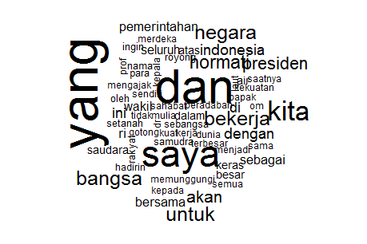
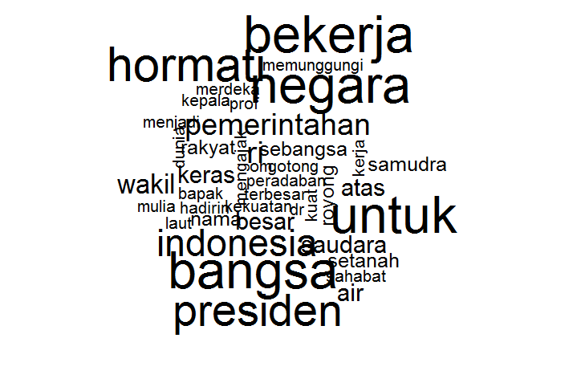
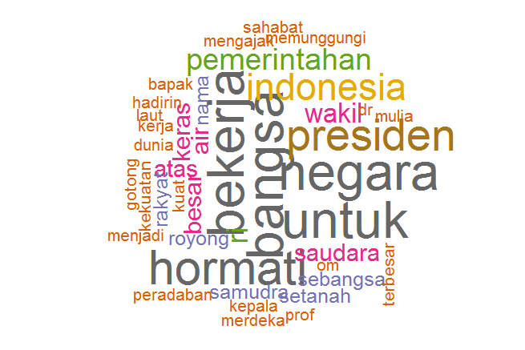

Bagaimana menampilkan data teks agar menarik sekaligus mudah dipahami?
Tentu akan lebih baik menggunakan grafik dibandingkan dengan bentuk
tabel yang berisi angka-angka, bukan? Ada berbagai macam grafik yang
bisa digunakan. Untuk data teks, *word cloud* adalah salah satu pilihan.

# Apa itu *word cloud* ?

*Word cloud* (disebut juga *text cloud* atau *tag cloud*) merupakan
salah satu metode untuk menampilkan data teks secara visual. Grafik ini
populer dalam *text mining* karena mudah dipahami. Dengan menggunakan
*word cloud*, gambaran frekuensi kata-kata dapat ditampilkan dalam
bentuk yang menarik namun tetap informatif. Semakin sering satu kata
digunakan, maka semakin besar pula ukuran kata tersebut ditampilkan
dalam *word cloud*.

Jika ingin mengetahui lebih detail tentang *word cloud*, [artikel
ini](http://www.surveygizmo.com/survey-blog/what-you-need-to-know-when-using-word-clouds-to-present-your-qualitative-data)
sayang untuk dilewatkan.

# Membuat *word cloud* dengan R

*Word cloud* sangat mudah dibuat. Melalui situs seperti
[Wordle](http://www.wordle.net), [Tagxedo](http://www.tagxedo.com) dan
[Tag Crowd](http://tagcrowd.com/) kita dapat membuat *word cloud* secara
*online* dengan cepat. Sementara para pengguna R patut mengucapkan
terimakasih kepada **Ian Fellows** yang telah menulis `wordcloud`,
sebuah *package* untuk membuat *word cloud* dengan R. *Package* ini
tersedia gratis di [repositori
CRAN](http://cran.r-project.org/web/packages/wordcloud/).

Secara garis besar, pembuatan *word cloud* dengan *package* `wordcloud`
dapat dikerjakan dalam dua tahap, yaitu persiapan data dan pembuatan
*word cloud* itu sediri.

### Persiapan data

Sebagai ilustrasi kita coba buat *word cloud* dari naskah pidato pertama
Presiden RI ke-7 sesaat setelah dilantik. Naskah tersebut didapat dari
[Tribun
News](http://www.tribunnews.com/nasional/2014/10/20/isi-lengkap-pidato-joko-widodo-usai-pelantikan-presiden-di-mpr),
yang saya salin ke dalam file [pidato-presiden.txt
ini](https://raw.githubusercontent.com/nurandi/snippet/master/data/pidato-presiden.txt).\
Pertama, kita harus membaca file teks dengan fungsi `readLines()`:

```r
text = readLines("pidato-presiden.txt")
```

Sekarang kita mempunyai objek `text` yang merupakan *character vector*.
Selanjutnya, kita modifikasi vektor `text` tersebut sehingga tiap elemen
di dalamnya merupakan kata tunggal.

```r
text = unlist(strsplit(text, "\\W+"))
```

R bersifat *case-sensitive* sehingga dalam pemrosesan data teks, akan
lebih baik jika kita ubah `text` menjadi huruf kecil (*lower-case*) atau
huruf besar (*upper-case*).

```r
text = tolower(text)
```

Terakhir, hitung frekuensi setiap kata muncul dalam naskah pidato.

```r
text = data.frame(table(text))
```

*Data frame* `text` terdiri dari dua kolom, yaitu `text` atau daftar
kata-kata tunggal serta `Freq` yang merupakan frekuensinya.

### Membuat word cloud

Dalam R, *word cloud* dapat dibuat menggunakan *package* `wordcloud`
yang ditulis oleh **Ian Fellows**. Instal package `wordcloud` dari
repositori
[CRAN](http://cran.r-project.org/web/packages/wordcloud/index.html)
(apabila belum terinstal) lalu *load* ke dalam *R session*.

```r
install.packages("wordcloud", dependencies = T)
library(wordcloud)
```

*Ok, everything is ready, and it's time to generate a wordcloud!*.
Caranya mudah, cukup jalankan fungsi sederhana berikut

```r
wordcloud(text$text, text$Freq)
```

dan hasilnya ...



Bagaimana, mudah bukan?

Tapi tunggu, dari *word cloud* di atas kita bisa melihat bahwa kata
hubung dan kata bantu seperti "yang", "dan", "di", "dalam", "untuk"
serta kata-kata lain yang tidak memberikan informasi penting justru
tampak dominan. Kata-kata inilah yang biasa disebut sebagai
*stop-words*. Dalam pengolahan data teks, kata-kata ini lazimnya
diabaikan sehingga grafik yang dihasilkan lebih informatif. Dalam contoh
ini, saya akan gunakan daftar *stop-word* bahasa Indonesia dari
[ranks.nl](http://www.ranks.nl/stopwords/indonesian) yang bisa diunduh
[di
sini](https://raw.githubusercontent.com/nurandi/snippet/master/data/stopwords-id.txt).
Berikut adalah perintah untuk menghapus *stop-words* :

```r
stopw = readLines("stopwords-id.txt")
text = text[!is.element(text$text, stopw),]
```

Setelah *stop-words* dihapus, jalankan kembali fungsi `wordcloud()` dan
ini kira-kira *word cloud* yang akan kita peroleh.



Bagaimana, terlihat lebih baik?

Selanjutnya, kita bisa mencoba menambahkan parameter lain dalam fungsi
`wordcloud()` untuk memperbaiki atau mempercantik tampilan. Misalnya,

```r
wordcloud(text$text, text$Freq, random.order=FALSE, rot.per=0.25
   , colors=brewer.pal(8, "Dark2"))
```

Hasilnya ...



Untuk mengetahui parameter apa saja yang bisa digunakan berikut
penjelasannya, gunakan perintah `?wordcloud`.

Jika kode R di atas digabung, kita hanya memerlukan tidak lebih dari 10
baris perintah untuk membuat *wordcloud* sederhana.

```r
# Menghitung frequensi per kata
text = readLines("pidato-presiden.txt")
text = unlist(strsplit(text, "\\W+"))
text = tolower(text)
text = data.frame(table(text))

# Menghapus stop-words
stopw = readLines("stopwords-id.txt")
text = text[!is.element(text$text, stopw),]

# Generate word-cloud
wordcloud(text$text, text$Freq, random.order=FALSE, rot.per=0.25, colors=brewer.pal(8, "Dark2"))
```

Selamat mencoba :)
