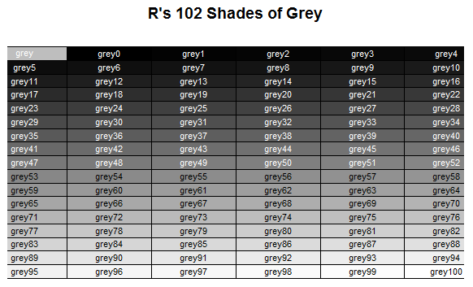
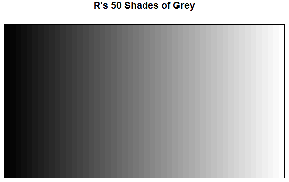

Tentu saja saya tidak akan membahas novel "50 Shades of Gray" karya E.
L. James yang film-nya baru-baru ini dirilis, melainkan tentang gradasi
warna hitam ke putih (abu-abu atau *grey*) dalam R. Tidak mau dikatakan
menjiplak, tapi memang lebih dari 90% isi artikel ini saya ambil dari
[tulisannya Andy
Nicholls](http://www.mango-solutions.com/wp/2015/02/50-shades-of-grey-according-to-r).
*All credit goes to him*. Terima kasih juga pada [Gregory
Piatetsky](http://www.kdnuggets.com/) yang telah berbagi artikel
tersebut di twitter.

<blockquote class="twitter-tweet"><p lang="en" dir="ltr">Why limit yourself to &quot;50 Shades of Grey?&quot; R has 102 shades of grey <a href="https://twitter.com/hashtag/rstats?src=hash&amp;ref_src=twsrc%5Etfw">#rstats</a> <a href="http://t.co/hDLXsgMhv3">http://t.co/hDLXsgMhv3</a> <a href="http://t.co/6enmkfOzAS">pic.twitter.com/6enmkfOzAS</a></p>&mdash; KDnuggets (@kdnuggets) <a href="https://twitter.com/kdnuggets/status/567104603431641088?ref_src=twsrc%5Etfw">February 15, 2015</a></blockquote> <script async src="https://platform.twitter.com/widgets.js" charset="utf-8"></script>

R mempunyai lebih dari 100 *shades of grey*, tidak hanya 50!. Mari kita
lihat. Pertama, kita dapat menemukan 224 nama warna yang mengandung kata
"gray" atau "grey" pada vektor yang dihasilkan oleh fungsi `colours()`.

```r
greys <- grep("gr[ea]y", colours(), value = TRUE)

length(greys)
# [1] 224
```

Kita masih menemukan warna dengan nama seperti "slategrey", "darkgrey"
dan "dimgrey", sehingga mari kita abaikan semua warna selain "gray" atau
"grey". Tentu saja ini hanya berdasarkan penamaan warna. Jika kita
mendefinisikan warna menggunakan RGB, kita bisa mendapatkan 256 warna
abu-abu.

```r
greys <- grep("^gr[ea]y", colours(), value = TRUE)

length(greys)
# [1] 204
```

Sehingga kita mendapatkan 204 warna "gray" atau "grey". Tapi tunggu.
Jika kita lihat lebih dalam, kita bisa menggunakan "gray" maupun "grey"
dalam R. Sehingga sebenarnya warna abu-abu dalam R bukanlah berjumlah
204 karena adanya duplikasi. Sehingga, mari kita ambil salah satunya
saja:

```r
greys <- grep("^grey", colours(), value = TRUE)

length(greys)
# [1] 102
```

Sehingga kita punya *102 Shades of Grey* dalam R!

```r
matrix(greys,ncol=6,byrow=T)

#       [,1]     [,2]     [,3]     [,4]     [,5]     [,6]     
#  [1,] "grey"   "grey0"  "grey1"  "grey2"  "grey3"  "grey4"  
#  [2,] "grey5"  "grey6"  "grey7"  "grey8"  "grey9"  "grey10" 
#  [3,] "grey11" "grey12" "grey13" "grey14" "grey15" "grey16" 
#  [4,] "grey17" "grey18" "grey19" "grey20" "grey21" "grey22" 
#  [5,] "grey23" "grey24" "grey25" "grey26" "grey27" "grey28" 
#  [6,] "grey29" "grey30" "grey31" "grey32" "grey33" "grey34" 
#  [7,] "grey35" "grey36" "grey37" "grey38" "grey39" "grey40" 
#  [8,] "grey41" "grey42" "grey43" "grey44" "grey45" "grey46" 
#  [9,] "grey47" "grey48" "grey49" "grey50" "grey51" "grey52" 
# [10,] "grey53" "grey54" "grey55" "grey56" "grey57" "grey58" 
# [11,] "grey59" "grey60" "grey61" "grey62" "grey63" "grey64" 
# [12,] "grey65" "grey66" "grey67" "grey68" "grey69" "grey70" 
# [13,] "grey71" "grey72" "grey73" "grey74" "grey75" "grey76" 
# [14,] "grey77" "grey78" "grey79" "grey80" "grey81" "grey82" 
# [15,] "grey83" "grey84" "grey85" "grey86" "grey87" "grey88" 
# [16,] "grey89" "grey90" "grey91" "grey92" "grey93" "grey94" 
# [17,] "grey95" "grey96" "grey97" "grey98" "grey99" "grey100"
```

Atau dalam *colors palette* (script R untuk menghasilkan *colors
palette* ini saya modifikasi dari [Earl F. Glynn's Color
Chart](//research.stowers-institute.org/efg/R/Color/Chart/)):

```r
greys = grep("^grey", colours(), value = TRUE)
colCount <- 6
rowCount <- 17
plot( c(1,colCount), c(0,rowCount), type="n", ylab="", xlab="",
      axes=FALSE, ylim=c(rowCount,0))

title("R's 102 Shades of Grey")

for (j in 0:(rowCount-1))
{
  base <- j*colCount
  remaining <- length(greys) - base
  RowSize <- ifelse(remaining < colCount, remaining, colCount)
  rect((1:RowSize)-0.5,j-0.5, (1:RowSize)+0.5,j+0.5,
       border="black",
       col=greys[base + (1:RowSize)])
  text((1:RowSize), j, greys[j*RowSize + 1:RowSize], cex=0.7,
       col=(ifelse(j<=8, "white", "black")))  
}
```



Lalu bagaimana mendapatkan *50 Shades of Grey*? Fungsi
`colorRampPalette` dapat digunakan untuk menghasilkan warna-warna baru
berdasarkan warna yang kita tentukan. Sehingga \*colors palette di
antara "grey0" (hitam) dan "grey100" (putih) dapat dibuat dengan mudah.

```r
shadesOfGrey <- colorRampPalette(c("grey0", "grey100"))

shadesOfGrey(2)
# [1] "#000000" "#FFFFFF"
```

Dengan kode berikut, kita bisa mendapatkan *50 Shades of Grey* versi R.

```r
fiftyGreys <- shadesOfGrey(50) 
mat <- matrix(rep(1:50, each = 50)) 
image(mat, axes = FALSE, col = fiftyGreys) 
box()
```



*So, why limit yourself to "50 Shades of Grey"?*
