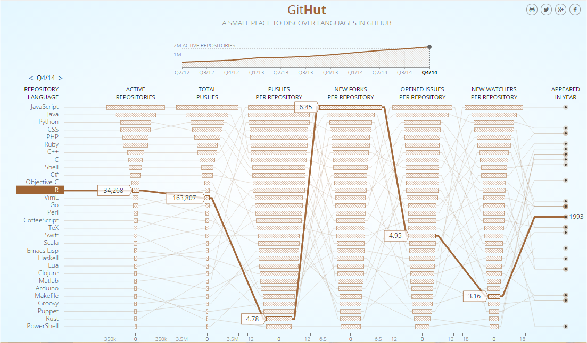

[GitHut.info](http://githut.info/) menampilkan statistik tentang
aktivitas bahasa pemrograman di [GitHub](https://github.com/) menurut
jumlah repositori, *pushes*, *forks* dan lain-lain. Dari situs tersebut
dapat dilihat bahwa R semakin populer di GitHub dari waktu ke waktu.
Pada kuarter ke-4 2014, R menempati urutan ke-12 sebagai bahasa
pemrograman dengan jumlah repositori aktif terbanyak (34K repositori).
Suatu repositori dianggap aktif jika pada periode ini minimal ada satu
perubahan/perbaikan pada kode yang dikirim dari repositori lokal ke
GitHub.com
([*push*](https://help.github.com/articles/github-glossary/#push)). Tiga
besar pada kategori ini berturut-turut adalah JavaScript, Java dan
Python.

<figure>
  
  <figcaption>GitHut.info menampilkan statistik aktifitas bahasa pemrograman pada GitHub.com </figcaption>
</figure> 

Pencapaian lain, seperti di tulis oleh Stephen Turner pada kicauannya:

<blockquote class="twitter-tweet">
On GitHub, <a href="https://twitter.com/hashtag/Rstats?src=hash&amp;ref_src=twsrc%5Etfw">#Rstats</a> has more new forks per repo than any other language <a href="http://t.co/9w6jYyWNtR">http://t.co/9w6jYyWNtR</a> <a href="http://t.co/nPb8MfOR1Z">pic.twitter.com/nPb8MfOR1Z</a>
&mdash; Stephen Turner (@strnr) <a href="https://twitter.com/strnr/status/565525852226867202?ref_src=twsrc%5Etfw">February 11, 2015</a></blockquote> 

R mempunyai rata-rata
[*forks*](https://help.github.com/articles/github-glossary/#fork) baru
per repositori tertinggi dibandingkan bahasa pemrograman apapun.
Artinya, kode R sedang digunakan dan dimodifikasi secara aktif oleh
banyak pengguna GitHub (sumber: [David Smith pada Blog
RevolutionAnalytics](http://blog.revolutionanalytics.com/2015/02/r-among-top-languages-on-github.html)).
