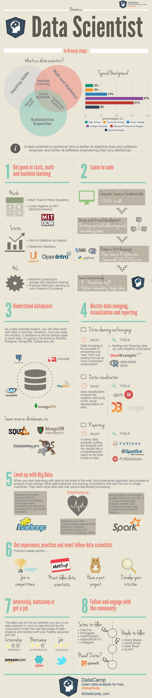

Mmmm ... tidak terlalu mudah, memang. Berikut adalah delapan langkah
~~mudah~~ untuk menjadi seorang *data scientist* menurut
[DataCamp.com](http://blog.datacamp.com/how-to-become-a-data-scientist/ "DataCamp")

### Get good at stats, math and machine learning

Ketiga skill ini
sangat mendasar bagi seorang data scientist. Jika tidak bisa belajar di
bangku universitas, kita bisa belajar secara online misalnya melalui
Udacity, Coursera dan UDemy.

<figure>
  
  <figcaption>Become a data scientist in 8 steps: the infographic (DataCamp.com)</figcaption>
</figure>

### Learn to code

Mencakup dasar-dasar ilmu komputer dan belajar
membuat code misalnya dengan SAS, R atau Python.

### Understand databases

Berbeda dengan saat belajar di universitas, di
perusahaan data hampir selalu disimpan dalam database (misalnya MySQL,
Teradata, Netezza), bukan lagi dalam file teks.

### Master data munging, visualization and reporting

Data munging
berarti melakukan transformasi terhadap raw data menjadi format lain
yang lebih mudah digunakan. Sementara visualizaton and reporting
mencakup pembuatan representasi visual dari data serta menyajikan
analisis berikut hasilnya ke dalam laporan yang konprehensif.

### Level up with Big Data

Saat ini, bagi kebanyakan data scientiest,
bekerja dengan menggunakan satu mesin saja tidak cukup dikarenakan data
yang sangat besar.

### Get experience, practice and meet fellows data scientists

Misalnya
dengan mengikuti kompetisi serta mengikuti pertemuan atau seminar
bersama sesama data scientist.

### Internship, bootcamp or get a job

Ini adalah jalan terbaik untuk
membuktikan apakah kita benar-benar seorang data scientist.

### Fellow and and engage with the community

Misalnya dengan menjadi
member atau subscriber website data scientiest dan follow twitter data
scientist.

Bagaimana menurut Anda?

