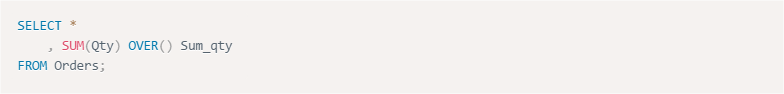

Beberapa waktu lalu, sesaat setelah mengganti theme blog ini dari
[TwentyFifteen](https://wordpress.org/themes/twentyfifteen/) menjadi
[Designer](https://arraythemes.com/themes/designer-wordpress-theme/),
saya mencari *syntax highlighter* untuk mempercantik *(prettify)*
tampilan kode yang saya posting di sini. Dari hasil pencarian dengan
Google, ada banyak yang bisa dipasang pada Wordpress. Namun, saya lebih
tertarik untuk menggunakan [prism.js](http://prismjs.com). Alasannya
sederhana: kombinasi warnanya yang saya rasa cocok dengan theme secara
keseluruhan, ukuran file javascript maupun css yang sangat kecil
sehingga waktu loading sangat cepat, mudah cara memasang dan
menggunakannya, dan yang terpenting, prism.js mendukung banyak bahasa
pemprograman termasuk R.


Pada kesempatan kali ini, saya akan jelaskan langkah mudah untuk
memasang syntax highlighter dengan prism.js pada Wordpress, yang
sebagaian besar saya adopsi dari [How To Implement Prism.js Syntax
Highlighting Into Your WordPress
Site](http://crambler.com/how-to-implement-prism-js-syntax-highlighting-into-your-wordpress-site/).

## Download Prism.js

Langkah pertama adalah kunjungi [laman donwload
Prism.js](http://prismjs.com/download.html). Di laman ini ada beberapa
opsi yang bisa kita pilih, yaitu:

-   Pada bagian **Compression level**, pilih **Minified version**.
-   Pilih **theme**. Blog ini menggunakan theme *default*, namun kita
    juga dapat memilih *theme* lain yaitu **dark**, **funky**,
    **okaidia**, **twilight**, **coy** dan **solarized light**.
-   Pilih bahasa pemprograman. Saya memilih beberapa bahasa pemrograman
    untuk analisis data seperti R, SAS, Python dan SQL. Kita bisa
    memilih sebanyak mungkin bahasa atau bahkan semua bahasa
    pemrograman, namun semakin banyak yang dipilih maka file javascript
    dan css pun akan semakin besar.
-   Kita juga dapat memilih **Plugin** yang menawarkan fungsi-fungsi
    tambahan seperti untuk penomoran baris, *highlight* baris tertentu
    dan lain-lain. Saya tidak menggunakan plugin apapun untuk blog ini.
-   Selanjutnya, klik "DOWNLOAD JS" sebagai "prism.js" dan "DOWNLOAD
    CSS" sebagai "prism.css". Tentu saja kita bisa menggunakan penamaan
    lain untuk file javascript dan css ini.

## Upload Prism.js

Langkah selanjutnya adalah *upload* kedua file di atas (prism.js dan
prism.css) ke folder theme Wordpress
(`wp-content/themes/<theme yang digunakan>`), melalui *File Manager*
pada *CPanel* atau dengan menggunakan FTP *client*. Saya menggunakan
theme "Designer-child", sehingga file prism.js dan prism.css di-*upload*
ke `wp-content/themes/designer-child`. Atau, bisa juga *upload* kedua
file tersebut folder khusus, misalnya
`wp-content/themes/designer-child/prism`.

## Buat function pada functions.php

Sisipkan kode berikut pada file **functions.php**

```php
<?php
function add_prism() {
    wp_register_style(
        'prismCSS',
        get_stylesheet_directory_uri() . '/prism.css'
    );
        wp_register_script(
        'prismJS',
        get_stylesheet_directory_uri() . '/prism.js'
    );
    wp_enqueue_style('prismCSS');
    wp_enqueue_script('prismJS');
}
add_action('wp_enqueue_scripts', 'add_prism');
?>
```

**Note:** Saya menyimpan file prism.css dan prism.js pada folder
"prism", sehingga saya harus sedikit memodifikasi *function* di atas
tengan menguaba *directory* `'/prism.css'` menjadi `'/prism/prism.css'`
dan `'/prism.js'` menjadi `'/prism/prism.js'`

## Menulis kode dengan Prism.js

Untuk menulis kode pada artikel (*post/page*), caranya adalah
menggunakan tag `<pre><code></code></pre>` dengan *class*
`language-markup`. Ganti "markup" dengan bahasa yang sesuai. Misalnya,
saya menuliskan kode SQL, maka untuk menggunakan *syntax highlighter* :

```html
<pre><code class="language-sql">
SELECT *
    , SUM(Qty) OVER() Sum_qty 
FROM Orders;
</code></pre>
```

Atau, jika Wordpress kita sudah support
[Markdown](https://nurandi.id/blog/format-teks-dengan-markdown/),
maka cukup tuliskan:

    ```.language-sql
    SELECT *
        , SUM(Qty) OVER() Sum_qty 
    FROM Orders;
    ```
 
Keduannya akan menghasilkan



Mudah bukan? Selamat mencoba :)
