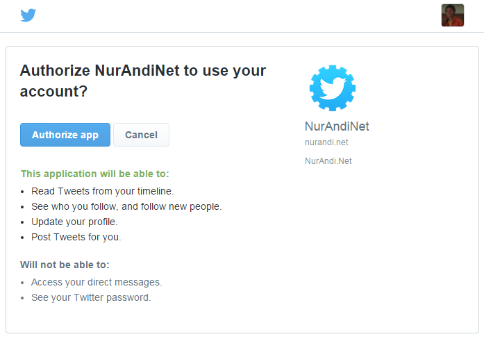
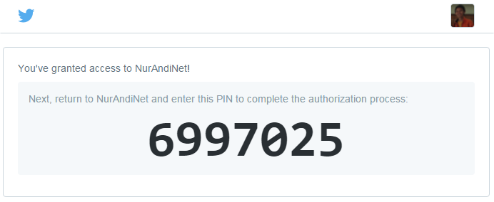
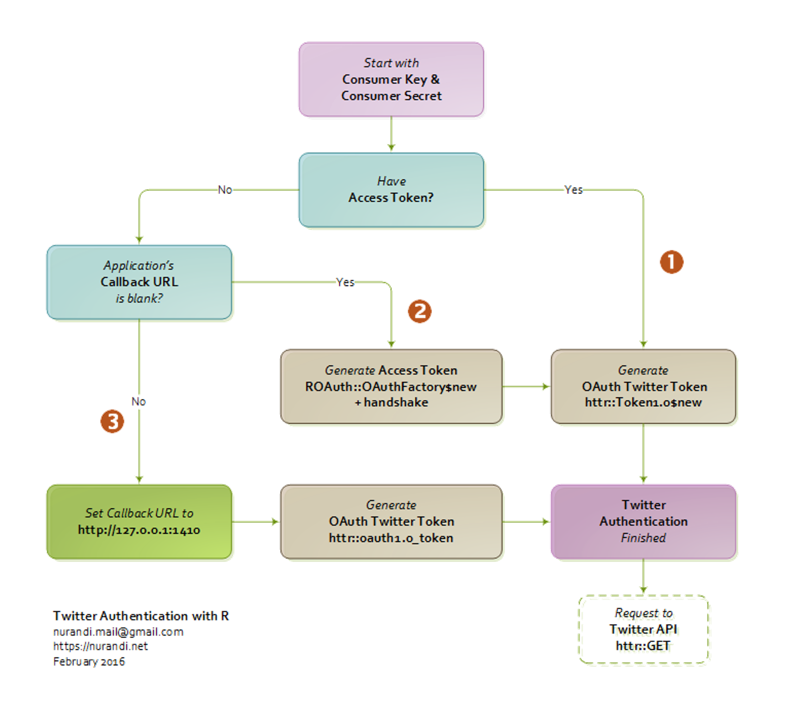

Twitter menerapkan [OAuth](http://oauth.net/) (saat ini [OAuth
1.0a](http://tools.ietf.org/html/rfc5849)) dalam penyediaan akses ke
API-nya. OAuth adalah sebuah ***authorization framework*** yang
memungkinkan aplikasi pihak ketiga untuk mendapatkan akses terbatas
secara aman dan ringkas. Dengan OAuth, untuk melakukan *request* ke API
Twitter, setiap aplikasi harus terlebih dahulu mendapatkan ***OAuth
access token***. *Access token* ini yang kemudian digunakan untuk
membuat ["permintaan
resmi"](https://dev.twitter.com/oauth/overview/authorizing-requests) ke
API Twitter, baik [REST](https://dev.twitter.com/rest/public) maupun
[Streaming](https://dev.twitter.com/streaming/overview).

Pada R, *Twitter authentication* dapat dilakukan dengan mudah dengan
menggunakan fungsi `setup_twitter_oauth()` yang tersedia pada *package*
[**twitteR**](https://github.com/geoffjentry/twitteR) seperti telah kita
diskusikan pada [artikel
sebelumnya](https://nurandi.id/blog/twitter-authentication-dengan-r/).
Pada kesempatan ini, saya lebih tertarik untuk membahas proses
autentikasi secara **"semi-manual"** dengan menggunakan *package*
[**ROAuth**](https://cran.r-project.org/package=ROAuth) dan
[**httr**](https://cran.r-project.org/package=httr). *Mmmm...* Ternyata
masih seputar [API Twitter](https://dev.twitter.com/rest/public), semoga
tidak membosankan :)

ROAuth dan httr
---------------

**ROAuth** (ditulis oleh [Jeff Gentry](https://github.com/geoffjentry))
merupakan *interface* untuk melakukan autentikasi ke server yang
menerapkan OAuth. ROAuth menangani proses *handshakes* dan
men-*generate*
[***signatures***](https://dev.twitter.com/oauth/overview/creating-signatures).
Sedangkan **httr** (ditulis oleh [Hadley
Wickham](https://github.com/hadley)) merupakan *interface* ke web API
yang telah *support* OAuth 1.0 dan 2.0. Kedua *package* tersebut akan
kita gunakan untuk membuat *authenticated requests*, sehingga akses ke
API Twitter dapat dilakukan melalui *R console*.

Twitter *authentication* menggunakan ROAuth dan httr
----------------------------------------------------

Proses autentikasi Twitter dengan menggunakan **ROAuth** dan **httr**
dapat dilakukan dengan tahapan sebagai berikut.

## Install package

Bisa dari [CRAN](https://cran.r-project.org/):

```r
install.packages(c("ROAuth", "httr")
```

Atau dari [Github](https://github.com) untuk versi *development*-nya

```r
library(devtools)
install_github(c("geoffjentry/ROAuth", "hadley/httr")
```

## Generate access token

Setiap *request* ke API Twitter membutuhkan "sepaket" *credentials* yang
terdiri dari *consumer key (API key)*, *consumer secret (API secret)*,
serta *access token* dan *access token secret*. *Credentials* tersebut
bisa dipoleh dengan cara [mendaftarkan sebuah
aplikasi](https://nurandi.id/blog/twitter-authentication-dengan-r/)
melalui [apps.twitter.com](https://apps.twitter.com/). Pastikan
*Callback URL* pada [Application Management -
Settings](https://apps.twitter.com/) dikosongkan. Setelah mendaftarkan
aplikasi, buka tab **Keys and Access Tokens** - di sana dapat kita
temukan *credentials* yang diperlukan untuk autentikasi.

Hanya tersedia *consumer key* dan *consumer secret* ketika aplikasi baru
dibuat. Untuk mendapatkan *access token* dan *access token secret*, klik
tombol **Create my access token**. Sekarang, kembali ke R dan simpan
*key* dan *token* tersebut. Misalnya:

```r
consumerKey <- "XXX"
consumerSecret <- "XXX"
accessToken <- "XXX"
accessTokenSecret <- "XXX"
```

Selain di-*copy-paste* dari [*Aplication
Management*](https://apps.twitter.com/), *access token* dan *access
token secret* juga dapat di-*generate* oleh R menggunakan *package*
**ROAuth**.

```r
library(ROAuth)

consumerKey <- "XXX"
consumerSecret <- "XXX"

requestURL <- "https://api.twitter.com/oauth/request_token"
authURL <- "https://api.twitter.com/oauth/authorize"
accessURL <- "https://api.twitter.com/oauth/access_token"

creds <- OAuthFactory$new(consumerKey = consumerKey,
                          consumerSecret = consumerSecret,
                          requestURL = requestURL,
                          accessURL = accessURL,
                          authURL = authURL)
creds$handshake()
```

Begitu *script* di atas dijalankan, proses *handshaking* dimulai. R akan
memberikan link (URL) yang harus kita buka melalui browser (biasanya
browser akan membuka link tersebut secara otomatis).

    To enable the connection, please direct your web browser to: 
    https://api.twitter.com/oauth/authorize?oauth_token=JFvu2AAAAAAAkQ9EAXXXXXXX
    When complete, record the PIN given to you and provide it here: 

Browser akan menampilkan laman di mana kita diminta untuk memberikan
"izin" kepada aplikasi.



Klik **"Authorize app"**, Twitter akan menampilkan sebuah **PIN**.



*Copy-paste* PIN tersebut ke *R console*, dan tekan **enter** - *access
token* berhasil kita *generate*. Jika terjadi *error*

    Error in function (type, msg, asError = TRUE)  : 
      SSL certificate problem: unable to get local issuer certificate

instal *package* [**RCurl**](https://cran.r-project.org/package=RCurl),
lalu tambahkan parameter pada `creds$handshake()` sehingga menjadi

```r
creds$handshake(cainfo = system.file("CurlSSL", "cacert.pem", package = "RCurl"))
```

Seluruh *credentials* telah disimpan pada objek `creds`. Selanjutnya,
ekstrak *access token*:

```r
accessToken <- creds$oauthKey
accessTokenSecret <- creds$oauthSecret
```

## Twitter token

Setelah mendapatkan *consumer key* dan *access token*, inilah saatnya
kita membuat *Twitter token* yang mengemas semua data yang
dipersyaratkan untuk *OAuth access*, meliputi *credentials* dan berbagai
*parameters*. Untuk tujuan ini kita gunakan *package* **httr**:

```r
library(httr)

app <- oauth_app("twitter",
                 key = consumerKey,
                 secret = consumerSecret)

twitter_token <- Token1.0$new(endpoint = NULL, 
                              params = list(as_header = TRUE), 
                              app = app, 
                              credentials = list(oauth_token = accessToken,
                                                 oauth_token_secret = accessTokenSecret))
```

**DONE!** Proses autentikasi selesai. Sekarang kita dapat men-*download*
data Twitter, baik melalui [REST
API](https://dev.twitter.com/rest/public) maupun [Streaming
API](https://dev.twitter.com/streaming/overview).

------------------------------------------------------------------------

## Download data Twitter

Twitter menyediakan banyak sekali API - terutama REST API - misalnya
[search tweets](https://dev.twitter.com/rest/public/search) untuk
mencari tweet berdasarkan kata kunci tertentu, [statuses user
timeline](https://dev.twitter.com/rest/reference/get/statuses/user_timeline)
untuk mendapatkan tweet terakhir yang diposting oleh user tertentu, atau
[followers
ids](https://dev.twitter.com/rest/reference/get/followers/ids) untuk
mendapatkan daftar *ID follower* dari user tertentu. Kita dapat
menggunakan fungsi `GET` pada *package* **httr** untuk mendapatkan data
twitter melalui APIs tersebut.

Saya membuat fungsi sederhana untuk mencari tweet berdasarkan kata kunci
*(keyword)* tertentu :

```r
search_twitter <- function(keyword, token) {

  require(httr)
  baseurl <- "https://api.twitter.com/1.1/search/tweets.json?q="
  url <- paste0(baseurl, URLencode(keyword))

  response <- GET(url, config(token = token))
  content <- content(response)[[1]]
  text <- unlist(sapply(content,function(x) x$text))

  return(text)
}
```

Misalnya, kita akan mencari tweet dengan kata kunci **"angkot bogor"**:

    angkot_bogor <- search_twitter("angkot bogor", token = twitter_token)

Hasilnya:

```r
angkot_bogor

#  [1] "Program One Way di Kota Bogor Terbentur Rute Angkot - Pojok Jabar https://t.co/hD7nkjjlHt #Bogor"                                            
#  [2] "Catatan kecil kehidupan di hari ini... maaf cuma iseng... \nUdah lama ga jalan2 ke bogor, liat angkot masih… — https://t.co/VsaBjUaIkc"      
#  [3] "Program One Way di Kota Bogor Terbentur Rute Angkot - Pojok Jabar https://t.co/txYWQ8kzkm #Bogor"                                            
#  [4] "Program One Way di Kota Bogor Terbentur Rute Angkot - Pojok Jabar https://t.co/dMSyKnnhMg #Bogor"                                            
#  [5] "Program One Way di Kota Bogor Terbentur Rute Angkot - Pojok Jabar https://t.co/8ZK3yCY1Zy #Bogor"                                            
#  [6] "RT @NyunyuCom: Kalo di Bogor, jangan sampe salah milih angkot! Biar kalo mau kemana-mana cepet, pilih angkot yg kayak gini gaes! https://t.…"
#  [7] "Kalo di Bogor, jangan sampe salah milih angkot! Biar kalo mau kemana-mana cepet, pilih angkot yg kayak gini gaes! https://t.co/hlA0tsDTSp"   
#  [8] "Kota hujan. Kota sejuta angkot. \xf0\u009f\u009a\u0098\u26c5\u2614\xf0\u009f\u008c\u009e @ Patung Kujang Bogor https://t.co/xZiOvisWvv"      
#  [9] "BOCORE - Angkot Bogor - Rp 70.000,- (S/M/L/XL/XXL) SMS/Telp : 081574232423 https://t.co/VRykHK1EkK https://t.co/GmoXJ9n4Zt #kaos #bogor"     
# [10] "Program One Way di Kota Bogor Terbentur Rute Angkot - Pojok Jabar https://t.co/UGxAD9PaUU #Bogor"                                            
# [11] "Move movee.....to second place we go....ujan2an di Bogor.....ihiiiyyyy...… (at Angkot 02 Cisarua Sukasari) — https://t.co/CANS9sTLlq"        
# [12] "RT @BogorSelatan_: Program One Way di Kota Bogor Terbentur Rute Angkot - Pojok Jabar https://t.co/Ac5J52xA7I #trafjak"                       
# [13] "pasar ciawi tetep pasar tumpah dan tempat ngetem angkot depan pasar macet hallloooo wakikota Bogor ,,, mana bukti nya ????"                  
# [14] "Program One Way di Kota Bogor Terbentur Rute Angkot - Pojok Jabar https://t.co/mBMZXt5jXA #Bogor #Jabar"                                     
# [15] "Program One Way di Kota Bogor Terbentur Rute Angkot - Pojok Jabar https://t.co/H5M8UuVyJ9 #Bogor" 
```

------------------------------------------------------------------------

[**UPDATE\#1:**] Sebelumnya telah dibahas bahwa dalam proses
autentikasi Twitter menggunakan `httr::Token1.0` diperlukan *consumer
key* dan *access token*. *Access token* dapat diperoleh baik dari laman
*applications management* maupun dengan cara *handshaking* menggunakan
`ROAuth::OAuthFactory`. Kabar baiknya, dengan hanya berbekal *consumer
key* dan *consumer secret*, kita sebenarnya bisa langsung melakukan
autentikasi *(generate Twitter token)* menggunakan fungsi
`httr::oauth1.0_token`.

```r
library(httr)
app <- oauth_app("twitter",
                 key = consumerKey,
                 secret = consumerSecret)

twitter_token <- oauth1.0_token(oauth_endpoints("twitter"), app = app)
```

*R console* akan menampilkan pesan berikut:

    Waiting for authentication in browser...
    Press Esc/Ctrl + C to abort
    Authentication complete.

Dengan fungsi ini, proses autentikasi dilakukan dalam browser dan kita
tidak perlu memasukkan PIN. Biarkan R bekerja dan tunggu beberapa detik
sampai proses autentikasi selesai. Agar autentikasi berhasil, *Callback
URL* **wajib** diisi dengan `http://127.0.0.1:1410`.

Dengan demikian, setidaknya ada tiga alternatif yang bisa digunakan
dalam proses autentikasi seperti yang tampilkan dalam *flow-char*
berikut.



[**UPDATE\#2:**] *Twitter token* yang di-*generate* baik
oleh `httr::Token1.0` maupun `httr::oauth1.0_token` dapat digunakan
sebagai pengganti fungsi `setup_twitter_oauth()` pada *package*
[**twitteR**](http://nurandi.id/blog/crawling-data-twitter-menggunakan-r/).

```r
assign("oauth_token", twitter_token)

library(twitteR)
tweets <- searchTwitter("indonesia raya")
sapply(head(tweets), statusText)

# [1] "Roy suryo iki kritik menpora saiki, koyo pener wae leh mu jabat ndan. Ngapalke indonesia raya sik wae :)))"                                  
# [2] "Waduh bapak menpora ga pernah ikut upacara nih jadi ga hafal INDONESIA RAYA :("                                                              
# [3] "Alhamdulillah, hari ini panen raya padi sehat di sawah Daqu Sehat Indonesia, Sukabumi. Seluruh https://t.co/4kbWuBGC65"                     
# [4] "RT @wawaraji: Sharing dg @basuki_btp gerakan @qluesmartcity #BERANIBERUBAH bersama @indorunners diawali nyanyikan Indonesia Raya https://t.…"
# [5] "ماشاءالله تبارك الله \n\nRio Haryanto Menggegerkan Austria GP2 Series 2015 Juara dan Indonesia Raya Berkumandang,... https://t.co/aUPzxewj4A"
# [6] "@UnsoedOfficial Apa Curug Favorit Netizen Banyumas Raya? https://t.co/A0O8JF2l2m #PollingTIN via @Times_indonesia"
```

Selamat mencoba, semoga bermanfaat :)

------------------------------------------------------------------------

#### Credits:

-   [smappR](https://github.com/SMAPPNYU/smappR) by [SMaPP at New York
    University](http://smapp.nyu.edu/)
-   [streamR](https://github.com/pablobarbera/streamR/blob/master/streamR/R/filterStream.R)
    by [Pablo Barberá](http://pablobarbera.com/)
-   [ROAuth](https://github.com/geoffjentry/ROAuth) by [Jeff
    Gentry](https://github.com/geoffjentry)
-   [httr](https://github.com/hadley/httr) by [Hadley
    Wickham](https://github.com/hadley)
