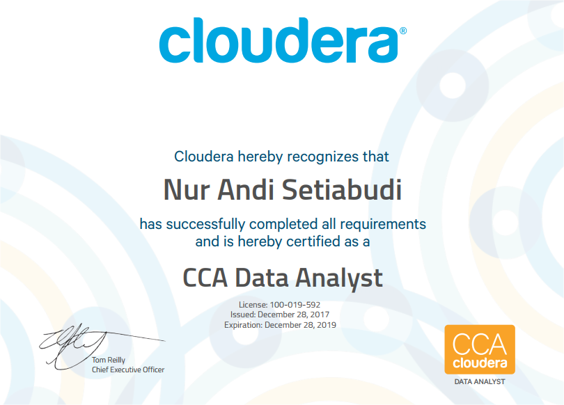

Setelah beberapa kali _mau daftar, tapi gak jadi, mau daftar lagi tapi cuman wacana_, akhirnya kemarin (28/12), jam 9-11 pagi, saya benar-benar ambil sertifikasi [*Cloudera Certified Data Analyst (CCA159)*](https://www.cloudera.com/more/training/certification/cca-data-analyst.html). Sekitar 40 menit setelahnya, saya dapat email dari Cloudera yang menyatakan saya lulus. _**Alhamdulillahirabbil alamin**_. 

Melalui email tersebut Cloudera tidak hanya menyampaikan bahwa saya lulus, tetapi juga keterangan untuk tiap-tiap soal: apakah benar atau salah. Jika salah, disebutkan juga alasannya. Diberitahukan juga bahwa saya akan mendapatkan sertifikat elektronik melalui email yang akan dikirimkan dalam waktu 2-3 hari kerja.

<figure>
  
  <figcaption>Yeay, sertifikat CCA Data Analyst, dikirimkan Cloudera dua hari setelah saya dinyatakan lulus. Vefifikasi: http://certification.cloudera.com/verify</figcaption>
</figure>

Di artikel ini saya coba *share* pengalaman seputar CCA Data Analyst yang saya ikuti kemarin itu. Mudah-mudahan bermanfaat.

## Mengapa mengambil sertifikasi?

Saya telah bekerja dengan Hadoop (Cloudera) sekitar tiga tahun dan lebih dari empat tahun terbiasa menggunakan SQL. Akan tetapi, tidak begitu banyak yang sudah saya eksplor, hanya fitur "itu-itu saja" yang saya gunakan. Ini menjadi alasan bagi saya untuk mempelajari lebih banyak lagi fungsionalitas Hadoop.

Alasan ~~jujurnya~~ lainnya sederhana saja: karena di-*support* (baca: dibayarin) kantor. _Hehe_. Bagi saya sertifikasi Cloudera lumayan mahal, USD295 per sekali ujian. Dan tidak bisa _refund_ kalau gagal. Sebenarnya, rencana awalnya mau ambil CCP Data Scientist (yang terdiri dari tiga ujian). Tetapi entah kenapa, sertifikasi tersebut sudah tidak ada lagi.

## Bagaimana tesnya?

_Exam_ atau ujian CCA Data Analyst (dan sertifikasi Cloudera lainya) ini dilakukan secara online melalui [examslocal.com](http://www.examslocal.com/). Karena itu, setelah  [registrasi](https://university.cloudera.com/content/cca175) di Cloudera, saya diminta untuk membuat akun di examslocal dan memilih sendiri waktu yang _pas_ untuk tes. Jika memang waktu belum memungkinkan, jangan khawatir. Kita bisa mengatur waktu di examslocal hingga maksimal satu tahun sejak registrasi di Cloudera. 

Ujian bisa dilakukan di mana saja, tapi harus ruangan _private_ dan tertutup. Area publik seperti _cafe_ tidak diperbolehkan. Sesaat sebelum ujian dimulai, selain diminta untuk menunjukkan kartu identitas (KTP, SIM atau paspor), saya juga diminta untuk mengarahkan kamera laptop ke seputar ruangan, ke meja, dan juga bawah meja. Di atas meja harus bersih, hanya ada laptop dan _mouse_. Sekedar kertas atau pernak-pernik diminta untuk dipindahkan.

Meskipun online, kita tetap diawasi dengan cara _screen sharing_ dan menyalakan kamera. Saya diminta untuk menjukkan _Windows task manager_ dan menutup semua aplikasi selain browser Chrome. Seluruh komunikasi dengan "pengawas" ini dilakukan melalui _chat_.

## Apa saja soalnya?

CCA Data Analyst adalah _performance based exam_. Kita langsung membuat _script_ dan _query_ untuk menyelesaikan setiap permasalahan berdasarkan _requirement_ yang ditentukan. Sama sekali tidak berupa pertanyaan dengan jawaban pilihan ganda atau _essay_. Meskipun namanya CCA Data Analyst, bukan _analytical skill_ (_statistics_ atau _machine learning_) yang diuji, tetapi lebih ke _technical skill_ bagaimana membuat _query_ untuk menghasilkan output yang diinginkan.  

_Exam environment_ menggunakan Ubuntu yang sudah terinstal Cloudera di dalamnya. Selain itu beberapa aplikasi desktop seperti Sublime Text, Python dan Eclipse juga disediakan, tapi hanya Sublime yang saya gunakan. 

Begitu tes dimulai, saya diberikan satu halaman web yang isinya antara lain: link ke pertanyaan, penjelasan singkat tentang konfigurasi Cloudera yang terinstall termasuk _hostname_, dan link ke beberapa dokumentasi (CDH, Hive, Sqoop, Impala dan lain-lain). Sebaiknya luangkan waktu untuk membaca sekilas halaman ini. 

Saya diberi sembilan soal _(problem)_, terdiri dari

* Membuat tabel di metastore dari data berformat Avro,
* Konversi data HDFS dari text menjadi Parquet,
* Membuat View,
* Loading data dari MySQL ke HDFS,
* dan soal yang paling banyak adalah membuat query (join, union, transform kolom, sorting, _simple_ regex) untuk menyelesaikan _case_ tertentu. Bagi rekan-rekan yang sudah terbiasa dengan SQL, saya yakin ini sangat mudah. 

Sebenarnya cuma ada dua soal yang secara eksplisit diminta menggunakan Hive, sisanya boleh pakai apa saja (Hive, Impala, Pig atau yang lainnya). Saya sendiri menggunakan Hive, Impala dan Sqoop.   

Sebagai gambaran bagaimana contoh soalnya, silakan simak video dari Clodera berikut (video resmi di upload di [vimeo](https://player.vimeo.com/video/199747760)).



Ya, memang sesederhana itu. Saya sendiri berhasil menyelesaikan delapan soal dengan benar (Skor minimum untuk lulus adalah 70%). Satu yang tidak bisa saya selesaikan adalah membuat table dari data Avro. Sama sekali tidak punya pengalaman dan tidak mempelajari ini sebelumnya. Sebenarnya saya sudah berusaha mencari di dokumentasi, sayangnya waktu tidak cukup.

## Bagaimana persiapan sebelum sertifikasi?

Karena ini adalah _performance-based (hand-on) exam_, cara terbaik untuk persiapan ini adalah _practice, practice and practice..._ Saya beruntung karena sebelum mengambil sertifikasi sudah punya sedikit pengalaman dengan ekosistem Hadoop (terutama Hive dan Sqoop) dan juga SQL. Untuk pendalaman, saya latihan melalui [Cloudera Data Analyst Training](https://www.cloudera.com/more/training/courses/data-analyst-training.html) (lagi-lagi _sponsored by_ kantor). Selama pendalaman ini, saya lebih fokus ke file format, mencoba berbagai fungsi di Hive/Impala, dan menulis sendiri kode huruf-demi-huruf (tanpa _copy-paste_, hehe).

## _Last but not least_

Latihan sudah maksimal dan segala sesuatunya sudah dipersiapkan, tapi kadang ada hal tak terduga yang membuat rencana tidak berjalan. Berikut tips dari saya.

* Karena online, koneksi internet sangat penting. Remokendasinya memang "hanya" 5Mbps, tapi menggunakan koneksi dengan kecepatan yang lebih tinggi lebih baik. Saya yang pakai wifi 10Mbps merasa kurang nyaman; beberapa kali masih ada _lag_. Tidak ada salahnya juga mempersiapkan koneksi cadangan. 

* _Time management_ sangat penting. Kita hanya punya waktu 120 menit untuk menyelesaikan 8-12 soal. Kita tidak harus mengerjakan secara berurutan, jadi kerjakan yang mudah dulu.

* Mulailah mencoba menggunakan Ubuntu dan juga Terminal-nya, termasuk _short-cut_ untuk _copy-paste_. Saya biasanya menggunakan Windows dengan Putty atau XShell, kemarin merasa sangat kerepotan saat akan _copy-paste_. 

* Sebelum ujian, sesekali bukalah dokumentasi Cloudera, Hive, Sqoop, dan _tools_ lain yang relevan. Ini akan sangat membantu ketika kita lupa nama fungsi atau kode tertentu. Saya sendiri hanya punya beberapa menit sebelum waktu berakhir untuk membuka dokumentasi. Dan itu tidak cukup.

* Saat ujian:
  * Sebelum membukan soal/*problem*, sempatkan untuk membaca halaman paling awal. Di sana mungkin ada informasi penting yang diperlukan untuk mengerjakan soal, seperti _hostname, username_ dan juga _password_
  * Baca teliti _instruction, data description_ dan juga _output requirements_ di setiap soal. Pastikan menjawab sesuai _requirements_ yang diminta
  * Jika waktu masih tersedia, coba _review_ kembali jawaban-jawabannya. Dan sekali lagi, pastikan sesuai _requirements_ ya. 

Oke. Semoga bermanfaat. Kalau ada yang ingin ditanyakan bisa melalui kolom komentar ya. Atau email ke `nurandi.mail[at]gmail.com`.

_Good luck !_
