Sudah 2019. Artikel terakhir di blog ini ditulis pada 29 Desember 2017. Artinya, sepanjang 2018 tidak ada satupun artikel yang saya _publish._ :( 

Ketika saya "berniat" menulis kembali beberapa hari yang lalu, saya baru menyadari bahwa laptop yang saya pakai saat ini ternyata belum terpasang "mesin" untuk menulis blog. Memang, sepanjang 2018, laptop sudah 2x berganti. *Dulu* saya menggunakan [Wordpress](https://wordpress.org/), salah satu _content management system_ (CMS) populer, untuk menulis blog. Belakangan, Wordpress berkembang tidak hanya sebagai "mesin" blog, tetapi juga dapat digunakan untuk membuat _website_ portal, toko _online_, bahkan forum. Bagi saya - yang hanya memanfaatkannya untuk blog dan itu pun tidak rutin - Wordpress terlalu _overkill_ alias berlebihan. Terlalu banyak fitur :D Karena itu, setelah menemukan artikel tentang Jekyll sekitar dua tahun lalu dan kemudian membandingkannya dengan Wordpress, saya mantap beralih untuk menjadikan Jekyll sebagai "mesin" di belakang blog saya. 

Sekalian install Jekyll, saya tuliskan saja tahapannya. Lumayan, dapat satu artikel kan. Selain sebagai catatan saya, mudah-mudahan bisa bermanfaat ketika ada yang membutuhkan. 


# Apa itu Jekyll?

Baik, saya mulai dengan perkenalan dulu. Apa itu Jekyll?

Kita tahu bahwa ada dua jenis _website_: _dynamic_ dan _static_. Pada _dinamic website_ - misalnya yang dibuat menggunakan CMS seperti Wordpress, [Joomla](https://www.joomla.org/), [Drupal](https://www.drupal.org/) dan [Blogger/Blogspot](https://www.blogger.com) - informasi atau konten untuk mengisi sebuah halaman _web_ disimpan dalam _database_ yang kemudian akan ditarik ketika ada "perintah" atau _query_. Sebagai contoh, ketika kita akan melakukan pencarian produk di [Tokopedia](https://www.tokopedia.com/search?q=iphone+xs&source=universe&st=product), halaman HTML utuh yang berisi hasil pencarian sebenarnya tidak ada. Tetapi Tokopedia mempunyai _template_ khusus untuk memuat hasil pencarian. Sistem akan melakukan _query_ untuk mencari produk pada _database_ sesuai kata kunci, selanjutnya daftar produk yang ditemukan akan dimuat dalam _template_ tersebut. 

Di sisi lain, _static website_ tidak menggunakan _database_. Seluruh informasi yang akan ditampilkan pada suatu halaman _web_ memang sudah ada pada file HTML-nya. Tidak ada lagi proses _query_. File-file HTML ini dapat ditulis satu-persatu menggunakan _text editor_ seperti Notepad atau Sublime Text, atau dapat pula dihasilkan secara otomatis menggunakan "_static site generator_" seperti *Jekyll*. 

[Jekyll](https://jekyllrb.com/),  sesuai _tagline_-nya "_a simple, blog-aware, static site generator_" adalah _software_ untuk membuat blog statis. Untuk menghasilkan sebuah blog, Jekyll hanya membutuhkan _template_, file-file artikel yang ditulis dengan format [Markdown](https://www.nurandi.id/blog/format-teks-dengan-markdown/) dan sebuah file konfigurasi. Kemudian hasilnya kita _upload_ ke _server_. Itulah blog kita. Sesederhana itu. Mungkin terdengar seperti alternatif yang hanya cocok untuk para "geek", tapi sebenernya Jekyll (dan juga _static blog_ lainnya) mempunyai banyak kelebihan dibandingkan Wordpress *dkk*, di ataranya:

1. Seperti yang sudah saya sampaikan, Wordpress itu _overkill_. Terlalu berlebihan, setidaknya untuk kebutuhan saya dalam membuat blog. Sementara itu, Jekyll memang dikhususkan sebagai _blogging platform_. Meskipun jauh lebih *simple,* Jekyll tetap kaya akan fitur-fitur yang dibutuhkan untuk membuat blog. 
2. Jekyll jauh lebih cepat. Itu karena semua halaman yang ditampilkan memang sudah benar-benar "jadi". Tidak ada lagi _query_ ke _database_. Selain itu, memuat file statis pada halaman *website* membutuhkan sumberdaya yang jauh lebih kecil di sisi _server_.
3. Karena _server_ hanya berisi file-file statis, Jekyll lebih aman dari "gangguan" _hacker_ yang tidak bertanggungjawab. Tidak ada sesuatu yang bisa disasar oleh _hacker_, kecuali mereka punya _username_ dan _password_-nya :D Bandingkan dengan _website_ berbasis Wordpress yang mempunyai [banyak "lubang" untuk dieksploitasi](https://www.wpwhitesecurity.com/statistics-highlight-main-source-wordpress-vulnerabilities/).
4. Jekyll adalah "mesin" di belakang [Github](https://github.com). Karenanya, dengan mudah kita bisa _publish_ blog pada Github. Gratis. Dengan Github, setiap perubahan pada blog kita akan terekam, meskipun hanya merubah satu huruf. Ya, Github adalah salah satu layanan _versioning control_ yang paling populer. Selain itu, dengan Github memudahkan kita untuk kolaborasi.
3. Jekyll menggunakan Markdown. Artinya saya bisa membuat artikel yang berisi _R scripts_ dengan [R Markdown](https://rmarkdown.rstudio.com/). 

Tidak ada yang sempurna. Jekyll pun punya kelemahan dibandingkan Wordpress, di antaranya:

1. Tidak bisa _update_ blog secara _live_. Perubahan dilakukan secara "lokal", baru kemudian blog kita _generate_ ulang.
2. Menulis artikel pada Jekyll artinya menulis sebuah file teks. _Formating_ dilakukan dengan menggunakan "simbol-simbol" khusus. Bagi yang tidak terbiasa tentu akan terasa merepotkan. Bandingkan dengan Wordpress, menulis artikel dan format-nya (teks tebal dan miring, ukuran huruf, menyisipkan gambar) semudah membuat tulisan dengan Microsoft Word: apa yang kita lihat itulah yang akan kita dapat _(what you see is what you get - WYSIWYG)_. 
3. Tidak seperti *template* Wordpress yang dapat diganti dengan "sekali" klik, mengubah *template* Jekyll relatif memerlukan "upaya ekstra", *tricky* alias rumit :(

# Instalasi Jekyll pada Windows 10

Jekyll pada Windows memang tidak didukung secara resmi. _Official-support_ hanya untuk Linux dan MacOS. Meskipun begitu, bukan berarti kita tidak bisa menginstal dan menjalankan Jekyll pada Windows. Saya berhasil menginstall Jekyll dengan memanfaatkan sumber utama dari [sini](https://jekyllrb.com/docs/installation/windows/) dan [sini](http://jekyll-windows.juthilo.com/) _plus_ beberapa upaya ekstra yang sumbernya lupa tidak saya catat. Ya, instalasi pada Windows memang tidak sesederhana pada Linux atau MacOS - yang hanya cukup dengan beberapa baris perintah (dan sambungan internet tentunya). Kabar baiknya, jika menggunakan Windows 10 (versi 1607 atau lebih baru), kita mempunyai opsi lain untuk menginjalankan Jekyll pada Windows dengan memanfaatkan _Windows Subsystem for Linux_ (WSL). Sederhananya, WSL adalah Linux yang diinstal pada Windows. Inilah yang saya jabarkan sekarang: Menginstal dan menjalankan Jekyll pada Windows 10 dengan WSL. Ada dua tahapan: 

### _Pertama,_ Instal Windows Subsystem for Linux pada Windows 10

Tahapannya:

1. Dari _start menu,_ klik **Settings**
2. Klik **Update & Security**
3. Klik **For Developer**
4. Pada bagian "Use developer features", pilih **Developer Mode**

    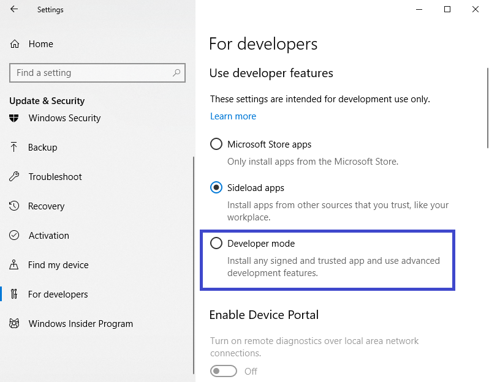
	
5. Windows akan menampikan konfirmasi untuk mengaktifkan _developer mode_. Klik **Yes**

    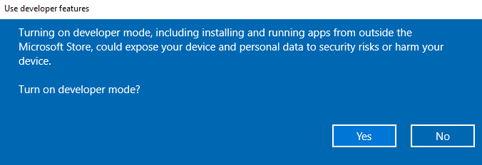
	
6. Windows akan menginstal komponen-komponen yang diperlukan. Setelah selesai lakukan **restart/reboot** PC

7. Masuk ke **Control Panel**
8. Klik **Programs**
9. Klik **Turn Windows features on or off**

    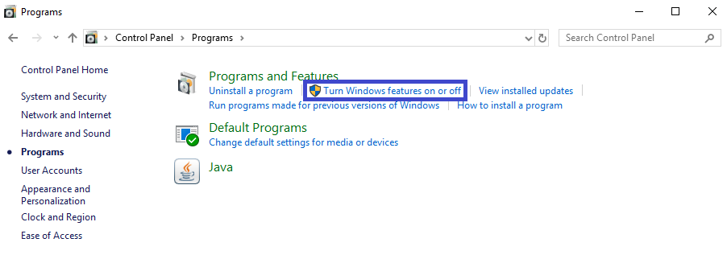

10. Cek **Windows Subsystem for Linux (beta)**, lalu klik **OK**

    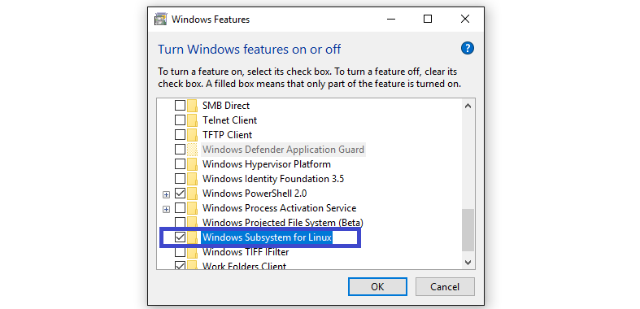

    **Update:** Seluruh tahapan 1-10 di atas dapat dilakukan dengan menjalankan perintah berikut pada **Windows PowerShell** (jalankan sebagai Administrator):

    ```
    Enable-WindowsOptionalFeature -Online -FeatureName Microsoft-Windows-Subsystem-Linux
    ```

    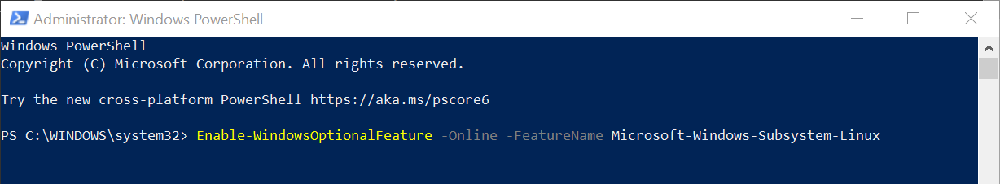


11. Windows akan menginstal komponen-komponen yang diperlukan. Setelah selesai lakukan **restart** kembali.
12. Dari *start menu*, buka **Command Prompt** (dapat dilakukan dengan memasukan kata kunci "cmd")
13. Pada *Command Prompt*, masukan perintah berikut lalu tekan tombol enter

    ```
	lxrun /install
	```
	
14. Ketikan **y** untuk melanjutkan. Tekan enter
15. Windows akan mulai mengunduh komponen-komponen yang diperlukan dan kemudian melakukan instalasi Linux.
16. Masukkan _username_	lalu tekan enter
17. Masukan _password_ lalu tekan enter
18. Masukan kembali _password_ lalu tekan enter

    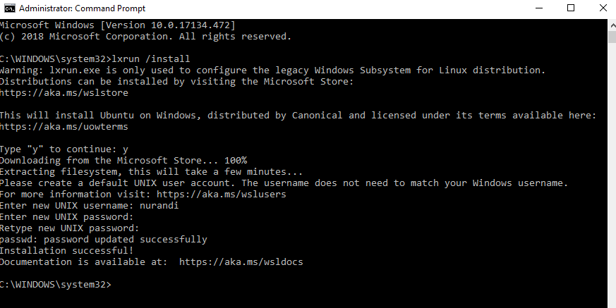
	
19. Instalasi **Windows Subsystem for Linux** selesai. *Restart* kembali PC


### _Kedua,_ Instal Jekyll pada Windows Subsystem for Linux

Tahapannya:

1. Dari *start menu*, buka aplikasi **Bash on Ubuntu on Windows**

    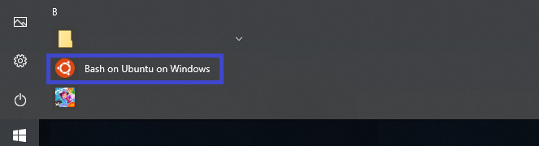
	
	Atau, bisa juga buka **Command Prompt**, lalu ketikan perintah berikut lalu enter

   ```
   bash
   ```

2. **Update Ubuntu** dengan perintah berikut lalu enter


   ```
   sudo apt-get update -y && sudo apt-get upgrade -y
   ```
	
	Masukkan _password_ yang dibuat pada tahapan pertama poin 17. Tunggu hingga proses selesai.
	
	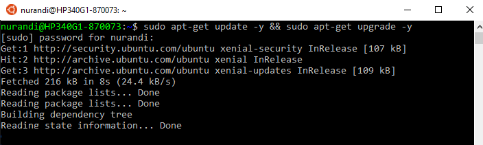
	

3. Jekyll berjalan pada **Ruby**. Instal **Ruby** dengan perintah berikut

   ```
   sudo apt-get install -y build-essential ruby-full
   ```
	
	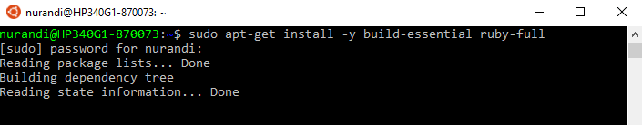	
	

4. Update **Ruby gem**
   
   ```
   sudo gem update –system
   ```
	
	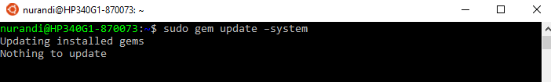	
	

4. Instal **Jekyll**
   
   ```
   sudo gem install jekyll bundler
   ```
	
	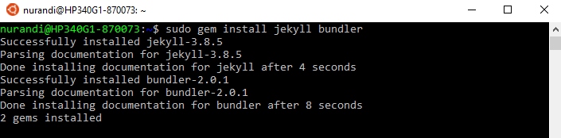	
	

	
### Membuat blog pertama dengan Jekyll

Setelah Jekyll sukses diinstal, saatnya kita membuat blog. Caranya sangat mudah. Masih menggunakan **Bash on Ubuntu on Windows** :

1. Masuk ke direktori di mana file-file statis Jekyll akan dibuat. Misalnya saya akan menyimpannya pada folder **D:\Personal\Blog**, maka masukkan perintah

   ```
   cd /mnt/d/Personal/Blog
   ```

2. Buat blog Jekyll baru, misalnya **myblog**

   ```
   jekyll new myblog
   ```
	
    Jekyll akan menginisiasi blog baru. Tunggu sampai proses selesai.
	
    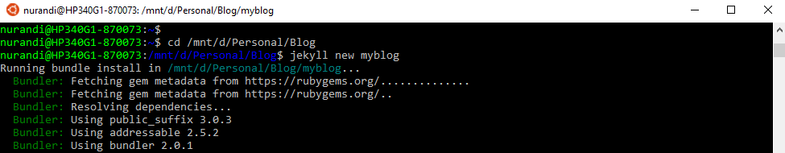
	
	Silakan periksa folder **D:\Personal\Blog**, akan ada folder baru dengan nama **myblog**. Folder inilah yang berisi file-file statis yang diperluka oleh Jekyll untuk membentuk blog.

	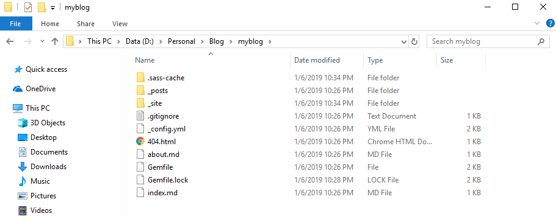
	
	Perintah `jekyll new myblog` menginisiasi blog baru dengan *template default* yaitu [minima](https://github.com/jekyll/minima). Jika ingin menggunakan *template* lain, bisa *download/clone* dari [Github](https://github.com/topics/jekyll-theme) atau *download* dari sumber lain seperti [ini](https://jekyllthemes.io/free) dan [ini](http://themes.jekyllrc.org/). **Ganti** semua file dan folder di dalam folder **myblog** dengan *template* yang diinginkan.
	
3. Masuk ke folder **myblog**

   ```
   cd /myblog
   ```

3. *Generate* blog dan jalankan di server lokal

   ```
   bundle exec jekyll serve
   ```
	
	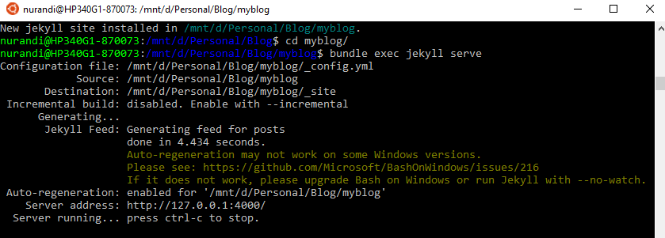
	
4. Buka browser. Blog dapat diakses melalui alamat **http://127.0.0.1:4000**

	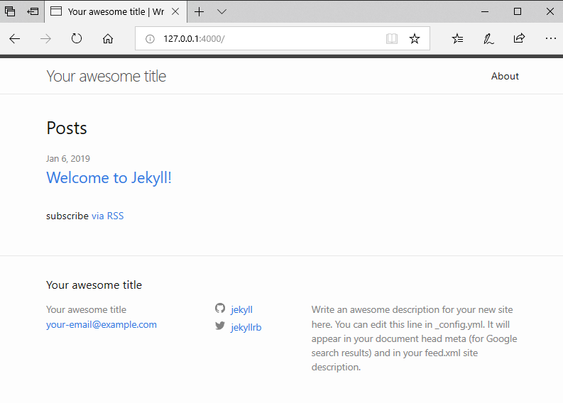

Selamat, blog statis pertama telah selesai dibuat dengan menggunakan Jekyll. Selanjutnya, kita perlu menyunting file konfigurasi **_config.yml** untuk mengubah judul, *link,* maupun catatan kaki *(footer).* Buka file **_config.yml** dengan *text editor* seperti Notepad. 

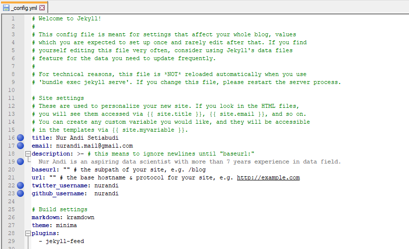
	
Perubahan file konfigurasi tidak langsung dieksekusi oleh. Silakan kembali ke **Bash on Ubuntu on Windows**, lalu *stop* Jekyll *service* dengan cara menekan tombol *(keyboard)* **Ctrl+C**, lalu jalankan kembali dengan perintah

```
bundle exec jekyll serve
```

Silakan *refresh* browser. Halaman muka blog akan berubah menjadi seperti ini

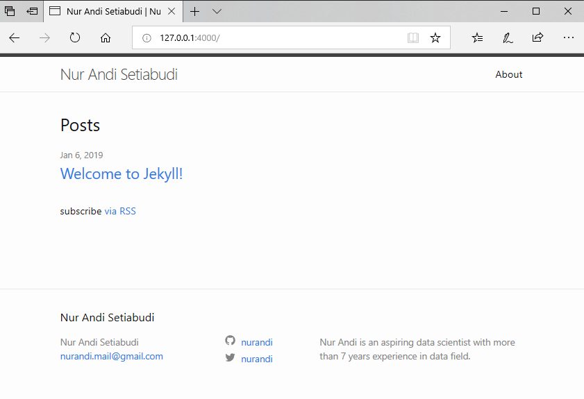

Selain mengubah *title*, *url* dan *description*, banyak pengaturan yang bisa dilakukan melalui file *_config.xml*, misalnya menampilkan menu, mengaktifkan komentar dengan [Disqus](https://disqus.com/) dan lain-lain. Selengkapnya bisa dipelajari di laman dokumentasi *template* yang digunakan.

---

Mudah bukan? Jika ada yang ingin didiskusikan, bisa tinggalkan pesan pada kolom komentar di bawah atau bisa hubungi saya melalui email `nurandi.mail@gmail.com`. Semoga bermanfaat :)


