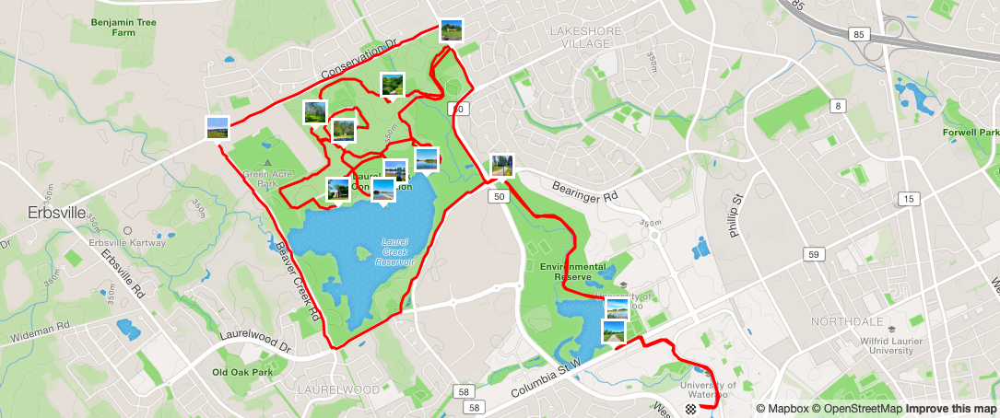

Beberapa waktu lalu (tepatnya tiga tahun lalu :D) saya menulis artikel tentang bagaimana [memetakan twit dengan menggunakan Leaflet](https://www.nurandi.id/blog/membuat-peta-dengan-r-dan-leaflet/). Kali ini, saya akan memetakan rute lari yang direkam  perangkat GPS (jam tangan ber-GPS, *smartphone*, dan lain-lain) dengan memanfaatkan *tools* yang sama, yaitu **R** dan dan *package* **leaflet**. Jika belum familiar dengan Leaflet, ada baiknya membaca [artikel ini](https://rstudio.github.io/leaflet/). *Bocoran* singkatnya, Leaflet adalah salah satu *library* JavaScript paling populer untuk membuat peta interaktif (bukan peta statis). *Package* **leaflet** dikembangkan oleh RStudio untuk memudahkan pembuatan peta melalui R, tanpa harus menulis kode JavaScript. 

# Data yang diperlukan

Tentu saja yang paling utama adalah **data** *tracking*/rute (lari, bersepeda, dan lain-lain) dalam bentuk titik-titik koordinat *(latitide-longitude)*. Data tersebut direkam dengan perangkat atau aplikasi GPS dan biasanya disimpan dalam format GPX *(GPS exchange format),* TCX *(training center XML),* FIT *(flexible and interoperable data transfer),* atau format lainnya. Contoh pada artikel ini akan menggunakan data berformat GPX. File GPX dapat diperoleh dari aplikasi *sport tracking* seperti [Garmin Connect](https://connect.garmin.com), [Endomondo](https://www.endomondo.com/) dan [Strava](https://www.strava.com).

* Garmin Connect (web) : klik **Activities** &#8594; **All Activities** &#8594; pilih salah satu *activity* &#8594; simbol *gear* &#9881; &#8594; **Export to GPX**.
* Endomondo (web) : klik **Training** &#8594; **Workouts** atau **History** &#8594; pilih salah satu *workout* &#8594; simbol &#x022C1; &#8594; **Export** &#8594; pilih **GPX Format** &#8594; **Export**.
* Strava (web) : klik **Training Log** atau **My Activities** &#8594; pilih salah satu *activity* &#8594; simbol *three dots* &#x022EF; &#8594; **Export GPX**. 

Tidak pernah menggunakan aplikasi *tracking* atau tidak punya file GPX? Silakan *download* punya saya di [sini](https://drive.google.com/drive/folders/16d9k_FTsn8Rg5eVGgDbBVWD8vpuvSOKg?usp=sharing).

<figure>
    
    <figcaption> Peta rute lari pada Strava beserta foto sepanjang rute yang ditampilkan dalam bentuk *pop-up*. <a href="https://www.strava.com/activities/2474503416">Detail pada Strava.</a></figcaption>
</figure>

**Nice to have:** Jika saat lari sempat ambil foto (menggunakan *smartphone* atau kamera digital dengan *location-enabled*), kita bisa memasangnya pada peta dalam bentuk *pop-up* (lihat screen-shot Strava di atas). Ini akan saya bahas pada artikel ini. Silakan ambil foto-fotonya di [sini]((https://drive.google.com/drive/folders/16d9k_FTsn8Rg5eVGgDbBVWD8vpuvSOKg?usp=sharing)) jika menggunakan file GPX saya.  

# Package(s)

Ada tiga *packages* yang akan digunakan, yaitu:

+ **plotKML** untuk membaca file GPX. Alternatif lain adalah *package* **XML** dan **maptools**.
+ **exifr** untuk membaca *exif (exchangeable image format)* atau metadata dari *image*, dalam hal ini kita akan membaca titik koordinat *(latitude-longitude)* di mana sebuah foto diambil.
+ **leaflet** untuk membuat peta.

Jika *package(s)* tersebut belum terinstal pada R, silakan instal terlebih dahulu dengan perintah


```r
install.packages(c("plotKML", "exifr", "leaflet"))
```

Khusus **leaflet**, bisa juga instal versi *development*-nya dari [Github](https://github.com/rstudio/leaflet). **exifr** berjalan dengan di atas **Perl**. Silakan instal [salah satu aplikasi Perl](https://www.perl.org/get.html) agar **exifr** dapat berfungsi sebagaimana mestinya. 


```r
if (!require("devtools")) install.packages("devtools")
devtools::install_github("rstudio/leaflet")
```

Setelah itu, *load* semua *packages*.


```r
library(plotKML)
library(exifr)
library(leaflet)
```

# Let's map your running route!

Data sudah tersedia. *Package(s)* yang diperlukan sudah terinstal. *Let's map your running route!* Ada beberapa tahapan sederhana yang harus dilakukan, yaitu membaca file GPX, membaca *exif* dari foto, dan membuat peta.

## Membaca file GPX untuk mendapatkan titik-titik koordinat dari rute

File GPX dapat dibaca menggunakan fungsi `readGPX` yang tersedia pada *package* **plotKML**. 


```r
gpx_file <- "Light_Trail_at_Laurel_Creek.gpx"
route <- readGPX(gpx_file)
```


```r
str(route)
```


```
## List of 5
##  $ metadata : NULL
##  $ bounds   : NULL
##  $ waypoints: NULL
##  $ tracks   :List of 1
##   ..$ :List of 1
##   .. ..$ Light Trail at Laurel Creek 🏞️:'data.frame':	7995 obs. of  5 variables:
##   .. .. ..$ lon       : num [1:7995] -80.5 -80.5 -80.5 -80.5 -80.5 ...
##   .. .. ..$ lat       : num [1:7995] 43.5 43.5 43.5 43.5 43.5 ...
##   .. .. ..$ ele       : chr [1:7995] "335.3" "335.3" "335.2" "335.1" ...
##   .. .. ..$ time      : chr [1:7995] "2019-06-23T13:08:04Z" "2019-06-23T13:08:05Z" "2019-06-23T13:08:06Z" "2019-06-23T13:08:07Z" ...
##   .. .. ..$ extensions: chr [1:7995] "14258" "1420" "1420" "1410" ...
##  $ routes   : NULL
```

Objek **route** merupakan *list* dengan lima elemen. Yang akan kita gunakan adalah elemen data-frame pada element **tracks**.


```r
route <- route$tracks[[1]][[1]]
str(route)
```


```
## 'data.frame':	7995 obs. of  5 variables:
##  $ lon       : num  -80.5 -80.5 -80.5 -80.5 -80.5 ...
##  $ lat       : num  43.5 43.5 43.5 43.5 43.5 ...
##  $ ele       : chr  "335.3" "335.3" "335.2" "335.1" ...
##  $ time      : chr  "2019-06-23T13:08:04Z" "2019-06-23T13:08:05Z" "2019-06-23T13:08:06Z" "2019-06-23T13:08:07Z" ...
##  $ extensions: chr  "14258" "1420" "1420" "1410" ...
```

Sekarang objek **route** berupa *data-frame* dengan kolom-kolom: *long (longitude)*, *lat (latitude)*, *ele (elevation)*, *time* dan *extensions*.

## Membaca *exif* dari foto untuk mendapatkan titik koordinatnya

*Exif* atau medatada bisa dibaca dengan fungsi `read_exif` pada *package* **exifr**. Saya asumsikan file-file foto berapa pada folder **img** di *working directory*.


```r
picture_files <- list.files("img", full.names = TRUE)

picture_point <- read_exif(picture_files, 
                          tags = c("FileName", "GPSLatitude", "GPSLongitude"), 
                          quiet = TRUE)
```


Parameter `tag` berguna untuk memilih *tag* atau informasi apa saja yang akan diambil. Jika ingin mengambil semua informasi yang tersedia, hilangkan parameter tersebut.


```r
str(picture_point)
```


```
## Classes 'tbl_df', 'tbl' and 'data.frame':	13 obs. of  4 variables:
##  $ SourceFile  : chr  "/Users/.../finish.png" "/Users/.../IMG_20190623_091723989_HDR~2.jpg" "/Users/.../IMG_20190623_095219047_HDR~2.jpg" "/Users/.../IMG_20190623_101644766~2.jpg" ...
##  $ FileName    : chr  "finish.png" "IMG_20190623_091723989_HDR~2.jpg" "IMG_20190623_095219047_HDR~2.jpg" "IMG_20190623_101644766~2.jpg" ...
##  $ GPSLatitude : num  NA 43.5 43.5 43.5 43.5 ...
##  $ GPSLongitude: num  NA -80.6 -80.6 -80.6 -80.6 ...
```

Beberapa file tanpa titik koordinat (GPSLatitude dan GPSLongitude `NA`). Untuk memilih **hanya** foto-foto yang memuat informasi koordinat, jalankan perintah berikut:


```r
picture_point <- picture_point[!is.na(picture_point$GPSLatitude), ]
str(picture_point)
```


```
## Classes 'tbl_df', 'tbl' and 'data.frame':	10 obs. of  4 variables:
##  $ SourceFile  : chr  "/Users/.../IMG_20190623_091723989_HDR~2.jpg" "/Users/.../IMG_20190623_095219047_HDR~2.jpg" "/Users/.../IMG_20190623_101644766~2.jpg" "/Users/.../IMG_20190623_102230650~2.jpg" ...
##  $ FileName    : chr  "IMG_20190623_091723989_HDR~2.jpg" "IMG_20190623_095219047_HDR~2.jpg" "IMG_20190623_101644766~2.jpg" "IMG_20190623_102230650~2.jpg" ...
##  $ GPSLatitude : num  43.5 43.5 43.5 43.5 43.5 ...
##  $ GPSLongitude: num  -80.6 -80.6 -80.6 -80.6 -80.6 ...
```

## Membuat peta!

Saatnye manampilkan rute lari beserta foto dalam peta menggunakan **leaflet**. Berikut tahapannya:

**Langkah #1**. Proses membuat peta dengan **leaflet** diinsiasi dengan fungsi `leaflet`.  Dengan menjalankan fungsi ini, kita sedang menyiapkan sebuah "leyer" kosong yang di atasnya akan kita "tumpuk" layer-layer, seperti peta dasar *(base map)*, *polyline*, *polygon*, *marker*, dan lain-lain.  


```r
m <- leaflet()
```

**Langkah #2**. Tambahkan peta dasar *(basemap)* pada layer kosong **m** dengan fungsi `addTiles`. Secara *default*, peta dasar yang digunakan adalah [OpenStreetMap](https://www.openstreetmap.org/).  


```r
m <- m %>% 
    addTiles(layerId = "Road",
         group = "Road")
```

Meskipun opsional, sangat disarankan untuk menggunakan parameter `layerId` dan `group`. `layerId` berfungsi untuk menandai sebuah layer atau objek pada peta. Satu atau beberapa layer bisa dikelompokkan dalam sebuah `group`. Salah satu kegunaan dari `layerId` maupun `group` adalah memudahkan kita dalam modifikas sebuah layer atau grup layer. Sebagai contoh untuk menghapus layer *basemap*:


```r
m %>% removeTiles("Road")
```

Operator `%>%` diadopsi dari *package* [*magrittr*](https://cran.r-project.org/web/packages/magrittr/index.html), bertindak sebagai *forward pipe operator*.

Perintah 


```r
m <- addTiles(m)
```

dapat ditulis dengan


```r
m <- m %>% addTiles
```

Atau secara umum


```r
y <- h(g(f(x)))
```

sama dengan


```r
y <- x %>% f %>% g %>% h
```

Kembali ke **leaflet**. Kita sudah mempunya peta dangan satu layer peta dasar dalam objek **m**, yang dapat ditampilkan dengan cara memanggil objek tersebut.


```r
m
```

<div class="iframe" style="position:relative;padding-top:30%;">
  <iframe src="https://rstudio-pubs-static.s3.amazonaws.com/510723_a13198697f414e4fad744ff18d5a5d67.html" frameborder="0" allowfullscreen
    style="position:absolute;top:0;left:0;width:100%;height:100%;"></iframe>
</div>

Gunakan tombol (+) dan (-) untuk *zoom-in* atau *zoom-out* peta.

**Langkah #3**. Selain menggunakan OpenStreetMap, kita dapat menambahkan *basemap* dari *provider* lain dengan fungsi `addProviderTiles`. Misalnya:

Peta *dark-mode* dari CartoDB


```r
m <- m %>% 
  addProviderTiles("CartoDB.DarkMatter", 
                   layerId = "Road Dark",
                   group = "Road Dark")
```

<div class="iframe" style="position:relative;padding-top:30%;">
  <iframe src="https://rstudio-pubs-static.s3.amazonaws.com/510724_26f3934f95c449318d8ab42fb4d3ccf1.html" frameborder="0" allowfullscreen
    style="position:absolute;top:0;left:0;width:100%;height:100%;"></iframe>
</div>

Atau, citra satelit dari ESRI


```r
m <- m %>% 
  addProviderTiles("Esri.WorldImagery", 
                   layerId = "Satellite",
                   group = "Satellite")
```

<div class="iframe" style="position:relative;padding-top:30%;">
  <iframe src="https://rstudio-pubs-static.s3.amazonaws.com/510725_6093f96266b74541b829ef672df5cd8c.html" frameborder="0" allowfullscreen
    style="position:absolute;top:0;left:0;width:100%;height:100%;"></iframe>
</div>

Daftar *provider* yang tersedia dapat dilihat di [sini](https://leaflet-extras.github.io/leaflet-providers/preview/). 


**Langkah #4**. Menampilkan titik-titik koordinat rute (yang sudah kita siapkan dalam data-frame **route**) pada peta. Rute merupakan objek *polylines*, dapat ditampilkan dengan menggunakan fungsi `addPolylines`:


```r
m <- m %>%
  addPolylines(data=route, lng = ~lon, lat = ~lat, 
               layerId = "Running Route",
               group = "Running Route")
```

<div class="iframe" style="position:relative;padding-top:30%;">
  <iframe src="https://rstudio-pubs-static.s3.amazonaws.com/510726_f824523f38d54170bbda99318fb146c6.html" frameborder="0" allowfullscreen
    style="position:absolute;top:0;left:0;width:100%;height:100%;"></iframe>
</div>

Kita dapat memasukkan parameter tambahan untuk mengatur tampilan, misalnya untuk mengubah warna. Namun, hapus dulu layer sebelumnya!.


```r
m %>% removeShape("Running Route")
```


```r
m <- m %>%
  addPolylines(data=route, lng = ~lon, lat = ~lat, 
               color = "red", opacity = 1,
               layerId = "Running Route",
               group = "Running Route")
```


<div class="iframe" style="position:relative;padding-top:30%;">
  <iframe src="https://rstudio-pubs-static.s3.amazonaws.com/510727_aedaaad2c3794caf8cf70264a60f21a3.html" frameborder="0" allowfullscreen
    style="position:absolute;top:0;left:0;width:100%;height:100%;"></iframe>
</div>

**Langkah #5**. Rute sudah tergambar dalam peta. Selanjutnya adalah membuat *markers* atau penanda. Kita mulai dengan *markers* titik *start* dan *finish*. Sebelum membuat *markers*, tentukan dulu titik koordinatnya.

* Titik *start* : baris pertama pada *data-frame* **route**


```r
start_point <- head(route, 1)
```

* Titik *finish* : baris terakhir pada *data-frame* **route**


```r
finish_point <- tail(route, 1)
```

Menambahkan *markers* pada peta dapat dilakukan dengan menggunakan fungsi `addMarkers`.


```r
m <- m %>%
  addMarkers(data = start_point, lng=~lon, lat=~lat, 
             popup = "Start"
             layerId = "start",
             group = "Start/Finish")
```

<div class="iframe" style="position:relative;padding-top:56.25%;">
  <iframe src="https://rstudio-pubs-static.s3.amazonaws.com/511095_857484b1752b4707abefaefe0c6db128.html" frameborder="0" allowfullscreen
    style="position:absolute;top:0;left:0;width:100%;height:100%;"></iframe>
</div>


Kita juga bisa mengubah *marker icon* dengan *icon* sesuai keinginan kita, misalnya dengan gambar **start.jpg**.

**Note:** Seluruh file gambar yang akan digunakan saya simpan di Github *directory*

```
https://raw.githubusercontent.com/nurandi/nurandi.github.io/masterimage
```
Agar penulisan *URL* dari tiap gambar yang digunakan menjadi lebih sederhana, saya membuat fungsi `img_url` berikut


```r
img_url <- function(file_name){
  file.path("https://raw.githubusercontent.com/nurandi/nurandi.github.io/masterimage
}
```

Sebelum gambar *custom* bisa digunakan sebagai *marker icon*, maka harus dibuat dulu dengan perintah `makeIcon`


```r
start_icon <- makeIcon(
  iconAnchorX = 12, iconAnchorY = 12,
  iconUrl = img_url("start.png")
)
```

Barulah kita ganti *default icon* dengan *custom icon*


```r
m %>% removeMarker("start")
```


```r
m <- m %>%
  addMarkers(data = start_point, lng=~lon, lat=~lat,
             popup = "Start",
             icon = start_icon,
             layerId = "start",
             group = "Start/Finish") 
```

<div class="iframe" style="position:relative;padding-top:56.25%;">
  <iframe src="https://rstudio-pubs-static.s3.amazonaws.com/511095_857484b1752b4707abefaefe0c6db128.html" frameborder="0" allowfullscreen
    style="position:absolute;top:0;left:0;width:100%;height:100%;"></iframe>
</div>


Cara yang sama bisa kita lakukan untuk menambahkan *marker* titik *finish*


```r
finish_icon <- makeIcon(
  iconAnchorX = 12, iconAnchorY = 12,
  iconUrl = img_url("finish.png")
)

m <- m %>%
  addMarkers(data = finish_point, lng=~lon, lat=~lat,
             popup = "Finish",
             icon = finish_icon,
             layerId = "finish",
             group = "Start/Finish")
```

<div class="iframe" style="position:relative;padding-top:56.25%;">
  <iframe src="https://rstudio-pubs-static.s3.amazonaws.com/556570_6ed6450fa9a34c9c89bc731f7086e55c.html" frameborder="0" allowfullscreen
    style="position:absolute;top:0;left:0;width:100%;height:100%;"></iframe>
</div>


**Langkah #6**. Membuat *markers* untuk foto pada titik koordinatnya. Caranya mirip dengan Langkah #5. Yang membedakan, jika sebelumnya *pop up* berupa teks **Start** dan **Finish** maka di sini kita gunakan HTML untuk menampilkan foto.

Buat *icon*


```r
picture_icon <- makeIcon(
  iconAnchorX = 12, iconAnchorY = 12,
  iconUrl = img_url("picture.png")
)
```

Data titik koordinat foto di simpan dalam *data frame* **picture_point**. Kita buat kolom **popup** berupa kode HTML untuk menampilkan foto.


```r
picture_point$popup <- paste('', sep='')
```

Tampilkan *markers*


```r
m <- m %>%
  addMarkers(data = picture_point, lng=~GPSLongitude, lat=~GPSLatitude,
             popup = ~popup,
             icon = picture_icon,
             options = popupOptions(maxWidth= "auto",keepInView = TRUE),
             group ='Pictures')
```

<div class="iframe" style="position:relative;padding-top:56.25%;">
  <iframe src="http://rstudio-pubs-static.s3.amazonaws.com/556572_15b456405a114aaead4d0e7aed54c121.html" frameborder="0" allowfullscreen
    style="position:absolute;top:0;left:0;width:100%;height:100%;"></iframe>
</div>

Jika salah satu *marker* kita klik, foto akan muncul pada *pop up*.

**Langkah #7**. Atau langkah terakhir adalah membuat *layer control*, agar *user* dapat:

* memilih *basemap* apa yang akan digunakan
* menampilkan atau menyebunyikan rute, *markers start/finish*, maupun *markers* foto.

Fungsi yang digunakan adalah `addLayersControl`


```r
m <- m %>%
    addLayersControl(position = 'topright',
                     baseGroups = c("Road", "Road Dark", "Satellite"),
                     overlayGroups = c("Running Route", "Start/Finish", "Pictures"),
                     options = layersControlOptions(collapsed = FALSE)) 
```

<div class="iframe" style="position:relative;padding-top:56.25%;">
  <iframe src="http://rstudio-pubs-static.s3.amazonaws.com/556573_0682aa10717340f7a09a36fa09a3da16.html" frameborder="0" allowfullscreen
    style="position:absolute;top:0;left:0;width:100%;height:100%;"></iframe>
</div>

**Selesai!**

***

Jika digabungkan, maka inilah kode lengkap untuk menampilkan rute lari beserta foto dengan menggunakan R dan **leaflet**:


```r
# install package(s) yg diperlukan
install.packages(c("plotKML", "exifr", "leaflet"))

# load package(s)
library(plotKML)
library(exifr)
library(leaflet)

# membaca rute dari file GPX
gpx_file <- "Light_Trail_at_Laurel_Creek.gpx"
route <- readGPX(gpx_file)
route <- route$tracks[[1]][[1]]

# tentukan titik start/finish
start_point <- head(route, 1)
finish_point <- tail(route, 1)

# membaca exif dari foto
picture_files <- list.files("img", full.names = TRUE)
picture_point <- read_exif(picture_files, 
                           tags = c("FileName", "GPSLatitude", "GPSLongitude"), 
                           quiet = TRUE)

# pilih foto yang mempunyai informasi koordinat
picture_point <- picture_point[!is.na(picture_point$GPSLatitude), ]

# membuat icon untuk titik start/finish/picture
img_url <- function(file_name){
    file.path("https://raw.githubusercontent.com/nurandi/nurandi.github.io/masterimage
}

start_icon <- makeIcon(
    iconAnchorX = 12, iconAnchorY = 12,
    iconUrl = img_url("start.png")
)

finish_icon <- makeIcon(
    iconAnchorX = 12, iconAnchorY = 12,
    iconUrl = img_url("finish.png")
)

picture_icon <- makeIcon(
    iconAnchorX = 12, iconAnchorY = 12,
    iconUrl = img_url("picture.png")
)

# membuat kode HTML untuk pop-up picture
picture_point$popup <- paste('', sep='')

# MEMBUAT PETA #

# inisiasi peta dengan leaflet
m <- leaflet() %>%
    
    # base map default
    addTiles(layerId = "Road",
             group = "Road") %>%
    
    # base map CartoDB
    addProviderTiles("CartoDB.DarkMatter", 
                     layerId = "Road Dark",
                     group = "Road Dark") %>%
    
    # basemap satellite
    addProviderTiles("Esri.WorldImagery", 
                     layerId = "Satellite",
                     group = "Satellite") %>%
    
    # route
    addPolylines(data=route, lng = ~lon, lat = ~lat, 
                 color = "red", opacity = 1,
                 layerId = "Running Route",
                 group = "Running Route") %>%
    
    # start marker
    addMarkers(data = start_point, lng=~lon, lat=~lat,
               popup = "Start",
               icon = start_icon,
               layerId = "start",
               group = "Start/Finish") %>%
    
    # finish marker
    addMarkers(data = finish_point, lng=~lon, lat=~lat,
               popup = "Finish",
               icon = finish_icon,
               layerId = "finish",
               group = "Start/Finish") %>%
    
    # picture marker dan pop-up
    addMarkers(data = picture_point, lng=~GPSLongitude, lat=~GPSLatitude,
               popup = ~popup,
               icon = picture_icon,
               options = popupOptions(maxWidth= "auto",keepInView = TRUE),
               group ='Pictures') %>%
    
    # layer control
    addLayersControl(position = 'topright',
                     baseGroups = c("Road", "Road Dark", "Satellite"),
                     overlayGroups = c("Running Route", "Start/Finish", "Pictures"),
                     options = layersControlOptions(collapsed = FALSE)) 

# selesai
m
```

***

Selamat mencoba. Semoga bermanfaat :)


 


