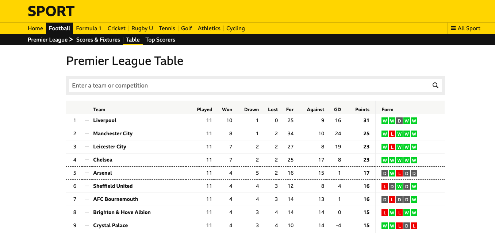

> Artikel ini merupakan lanjutan dari artikel sebelumnya berjudul [Web Scraping dengan R dan rvest](https://nurandi.id/blog/web-scraping-dengan-r-dan-rvest/). Silakan membaca artikel tersebut terlebih dahulu jika baru memulai mempelajari *web scraping* dengan **rvest**.

Salah satu favorit saya dalam *package* **rvest** adalah fungsi `html_table`. Sesuai dengan namanya, `html_table` berfungsi untuk *parsing* tabel HTML. Maksudnya, jika data yang akan di-*scrape* merupakan tabel dalam suatu halaman website HTML, fungsi ini secara "ajaib" akan mengubah tabel tersebut menjadi *data frame*. Keren bukan? Mari kita buktikan dengan *scraping* tabel klasemen Liga Inggris dari halaman [BBC Sport](https://www.bbc.com/sport/football/premier-league/table).

<figure>
    
    <figcaption>Klasemen Liga Inggris. Diakses dari <a href="https://www.bbc.com/sport/football/premier-league/table">BBC Sport</a> pada 5 November 2019. Semoga sampai akhir musim urutannya tidak berubah. YNWA!</figcaption>
</figure>

Kita mulai dengan *load* **rvest** dan baca HTML.

```r
library(rvest)

url <- "https://www.bbc.com/sport/football/premier-league/table"
html <- url %>% read_html
```

Melalui **Inspect elements** (dijelaskan pada artikel [sebelumnya]({{ base_path }}/blog/web-scraping-dengan-r-dan-rvest/)), kita mengetahui bahwa *CSS selector* yang memuat tabel klasemen adalah `.gs-o-table`. 

```
<table class="gs-o-table " data-reactid=".98jiqbvx9q.2.0.0.0.0.1.$competition-table-0">
```

Dengan hanya menggunakan fungsi `html_node` dan `html_table`, kita peroleh sebuah `data frame` tanpa perlu repot melakukan *parsing*.


```r
epl_table <- html %>%
    html_node(".gs-o-table") %>%
    html_table

str(epl_table)
```


```
## 'data.frame':	21 obs. of  12 variables:
##  $     : chr  "1" "2" "3" "4" ...
##  $     : chr  "team hasn't moved" "team hasn't moved" "team hasn't moved" "team hasn't moved" ...
##  $ Team: chr  "Liverpool" "Man City" "Leicester" "Chelsea" ...
##  $ P   : chr  "11" "11" "11" "11" ...
##  $ W   : chr  "10" "8" "7" "7" ...
##  $ D   : chr  "1" "1" "2" "2" ...
##  $ L   : chr  "0" "2" "2" "2" ...
##  $ F   : chr  "25" "34" "27" "25" ...
##  $ A   : chr  "9" "10" "8" "17" ...
##  $ GD  : chr  "16" "24" "19" "8" ...
##  $ Pts : chr  "31" "25" "23" "23" ...
##  $ Form: chr  "WWon 1 - 0 against Sheffield United on September 28th 2019.WWon 2 - 1 against Leicester City on October 5th 201"| __truncated__ "WWon 3 - 1 against Everton on September 28th 2019.LLost 0 - 2 against Wolverhampton Wanderers on October 6th 20"| __truncated__ "WWon 5 - 0 against Newcastle United on September 29th 2019.LLost 1 - 2 against Liverpool on October 5th 2019.WW"| __truncated__ "WWon 2 - 0 against Brighton & Hove Albion on September 28th 2019.WWon 4 - 1 against Southampton on October 6th "| __truncated__ ...
```

*Scraping* dan *parsing* tabel HTML 100% selesai. Tinggal sedikit *final-touches* untuk "membersihkan" data. **Pertama**, hapus kolom dan baris yang tidak perlu. Jika diperhatikan (silakan *print* `data frame`), dua kolom pertama serta satu baris terakhir tidak diperlukan dan dapat dihapus.

Hapus dua kolom pertama:


```r
epl_table[1:2] <- list(NULL)
```

Hapus satu baris terakhir (baris ke-21):


```r
epl_table <- epl_table[-21,]
```


```r
str(epl_table)
```


```
## 'data.frame':	20 obs. of  10 variables:
##  $ Team: chr  "Liverpool" "Man City" "Leicester" "Chelsea" ...
##  $ P   : chr  "11" "11" "11" "11" ...
##  $ W   : chr  "10" "8" "7" "7" ...
##  $ D   : chr  "1" "1" "2" "2" ...
##  $ L   : chr  "0" "2" "2" "2" ...
##  $ F   : chr  "25" "34" "27" "25" ...
##  $ A   : chr  "9" "10" "8" "17" ...
##  $ GD  : chr  "16" "24" "19" "8" ...
##  $ Pts : chr  "31" "25" "23" "23" ...
##  $ Form: chr  "WWon 1 - 0 against Sheffield United on September 28th 2019.WWon 2 - 1 against Leicester City on October 5th 201"| __truncated__ "WWon 3 - 1 against Everton on September 28th 2019.LLost 0 - 2 against Wolverhampton Wanderers on October 6th 20"| __truncated__ "WWon 5 - 0 against Newcastle United on September 29th 2019.LLost 1 - 2 against Liverpool on October 5th 2019.WW"| __truncated__ "WWon 2 - 0 against Brighton & Hove Albion on September 28th 2019.WWon 4 - 1 against Southampton on October 6th "| __truncated__ ...
```

**Kedua**, *reformat* kolom **Form**. Kita lihat, pada kolom **Form**, selain singkatan dan status juga ditulis pertandingan, skor dan tanggalnya. Seperti:


```r
epl_table$Form[1]
```


```
## [1] "WWon 1 - 0 against Sheffield United on September 28th 2019.WWon 2 - 1 against Leicester City on October 5th 2019.DDrew 1 - 1 against Manchester United on October 20th 2019.WWon 2 - 1 against Tottenham Hotspur on October 27th 2019.WWon 2 - 1 against Aston Villa on November 2nd 2019."
```

akan kita ubah menjadi **W,W,D,W,W**.

Untuk keperluan ini, kita akan menggunakan beberapa fungsi dari *package* [**stringr**](https://stringr.tidyverse.org/reference/index.html) yang juga dikembangkan oleh tim RStudio. Silakan instal dan *load package* **stringr**:


```r
install.packages("stringr")
library(stringr)
```

Pertama-tama, kita ekstrak teks **WWon**, **DDrew**, atau **LLost**. Gunakan fungsi `str_extract_all`, dengan *regular expression* `"WWon|DDrew|LLost"`. Simbol `|` berarti "atau".


```r
extract_form <- function(form){
    str_extract_all(form, "WWon|DDrew|LLost")
}

form <- sapply(epl_table$Form, extract_form, USE.NAMES = FALSE)
```


```r
str(form)
```


```
## List of 20
##  $ : chr [1:5] "WWon" "WWon" "DDrew" "WWon" ...
##  $ : chr [1:5] "WWon" "LLost" "WWon" "WWon" ...
##  $ : chr [1:5] "WWon" "LLost" "WWon" "WWon" ...
##  $ : chr [1:5] "WWon" "WWon" "WWon" "WWon" ...
##  $ : chr [1:5] "DDrew" "WWon" "LLost" "DDrew" ...
##  $ : chr [1:5] "LLost" "DDrew" "WWon" "DDrew" ...
##  $ : chr [1:5] "DDrew" "LLost" "DDrew" "DDrew" ...
##  $ : chr [1:5] "LLost" "WWon" "LLost" "WWon" ...
##  $ : chr [1:5] "WWon" "WWon" "LLost" "DDrew" ...
##  $ : chr [1:5] "DDrew" "LLost" "DDrew" "WWon" ...
##  $ : chr [1:5] "WWon" "LLost" "DDrew" "LLost" ...
##  $ : chr [1:5] "WWon" "WWon" "DDrew" "DDrew" ...
##  $ : chr [1:5] "DDrew" "LLost" "LLost" "DDrew" ...
##  $ : chr [1:5] "DDrew" "WWon" "LLost" "LLost" ...
##  $ : chr [1:5] "LLost" "WWon" "LLost" "DDrew" ...
##  $ : chr [1:5] "DDrew" "WWon" "WWon" "LLost" ...
##  $ : chr [1:5] "LLost" "LLost" "WWon" "LLost" ...
##  $ : chr [1:5] "LLost" "LLost" "DDrew" "LLost" ...
##  $ : chr [1:5] "LLost" "LLost" "DDrew" "LLost" ...
##  $ : chr [1:5] "LLost" "DDrew" "DDrew" "DDrew" ...
```

Selanjutnya dalam setiap elemen *list*, ekstrak satu huruf **W**, **D**, atau **L** lalu gabungkan dengan *delimiter* tanda koma. Ekstraksi huruf menggunakan fungsi `str_extract`.


```r
simply_form <- function(form){
    form %>%
        str_extract("W|D|L") %>%
        paste(collapse = ",")
}

form <- sapply(form, simply_form)
```


```r
str(form)
```


```
##  chr [1:20] "W,W,D,W,W" "W,L,W,W,W" "W,L,W,W,W" "W,W,W,W,W" ...
```

Terakhir, *update* kolom **Form** pada *data frame* **epl_table** dengan *vector* **form**.


```r
epl_table$Form <- form
```

Dan... ini hasil akhirnya


```r
print(epl_table)
```


```
##              Team  P  W D L  F  A  GD Pts      Form
## 1       Liverpool 11 10 1 0 25  9  16  31 W,W,D,W,W
## 2        Man City 11  8 1 2 34 10  24  25 W,L,W,W,W
## 3       Leicester 11  7 2 2 27  8  19  23 W,L,W,W,W
## 4         Chelsea 11  7 2 2 25 17   8  23 W,W,W,W,W
## 5         Arsenal 11  4 5 2 16 15   1  17 D,W,L,D,D
## 6       Sheff Utd 11  4 4 3 12  8   4  16 L,D,W,D,W
## 7     Bournemouth 11  4 4 3 14 13   1  16 D,L,D,D,W
## 8        Brighton 11  4 3 4 14 14   0  15 L,W,L,W,W
## 9  Crystal Palace 11  4 3 4 10 14  -4  15 W,W,L,D,L
## 10        Man Utd 11  3 4 4 13 11   2  13 D,L,D,W,L
## 11      Tottenham 11  3 4 4 17 16   1  13 W,L,D,L,D
## 12         Wolves 11  2 7 2 14 14   0  13 W,W,D,D,D
## 13       West Ham 11  3 4 4 14 17  -3  13 D,L,L,D,L
## 14        Burnley 11  3 3 5 14 18  -4  12 D,W,L,L,L
## 15      Newcastle 11  3 3 5  9 17  -8  12 L,W,L,D,W
## 16    Aston Villa 11  3 2 6 16 18  -2  11 D,W,W,L,L
## 17        Everton 11  3 2 6 11 17  -6  11 L,L,W,L,D
## 18    Southampton 11  2 2 7 10 27 -17   8 L,L,D,L,L
## 19        Norwich 11  2 1 8 11 26 -15   7 L,L,D,L,L
## 20        Watford 11  0 5 6  6 23 -17   5 L,D,D,D,L
```

Ajaib bukan? Selamat mencoba!


