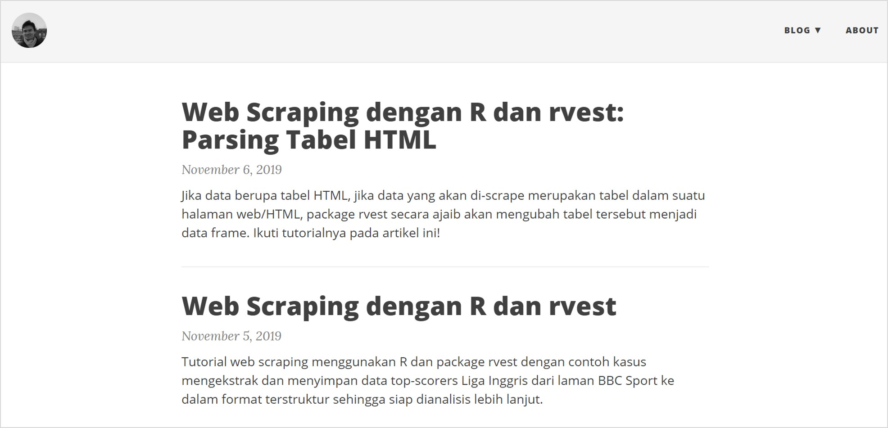
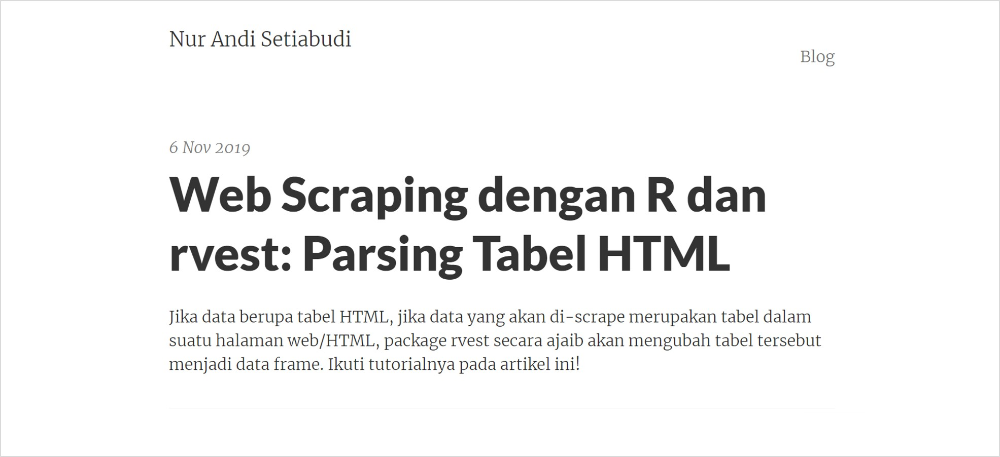
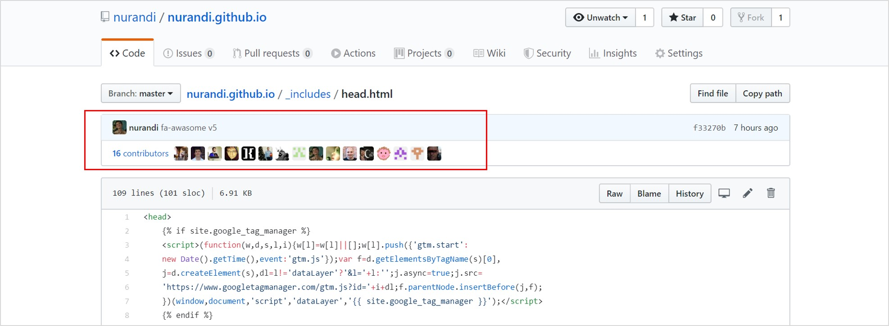
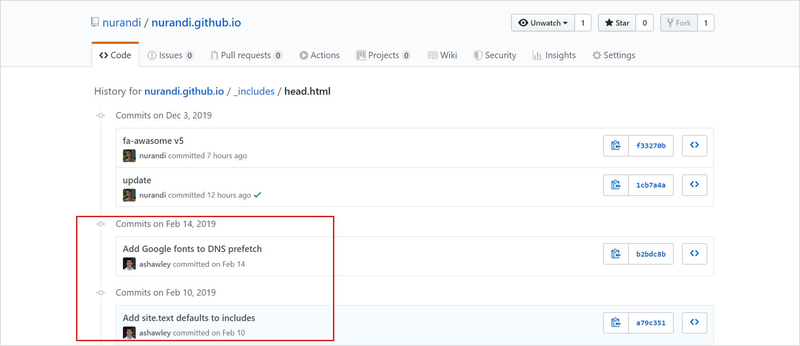

Salah satu nilai *plus* [Jekyll](https://jekyllrb.com/) adalah fleksibilitas untuk mengubah *theme*/tema. Meskipun merupakan *web statis*, nyatanya di jagad internet banyak sekali *theme* yang bisa digunakan untuk berbagai keperluan, mulai dari halaman biodata sampai web *ecommerce*. Tidak percaya? [Silakan Googling sendiri](https://www.google.com/search?q=jekyll+themes). Hanya saja, mengganti *theme* sebuah blog berbasiskan Jekyll ternyata tidak semudah mengganti *theme* pada Wordpress yang cukup dilakukan dengan beberapa klik saja. Ada "keruwetan" sendiri. Setidaknya itu yang sama alami dalam beberapa hari terakhir saat mengganti *theme* blog [NURANDI.id](https://nurandi.id); yang awalnya [beautiful-jekyll](https://github.com/daattali/beautiful-jekyll) saya ganti dengan [Pixyll](https://github.com/johno/pixyll). Sebenarnya kedua *theme* itu hampir serupa. Sama-sama *theme* minimalis yang fokus pada *readability*. Tapi saya merasa Pixyll ini lebih fresh. Baiklah!

<figure>
  
  <figcaption>Tampilan lama blog NURANDI.id dengan theme [beautiful-jekyll]</figcaption>
</figure>

Blog [NURANDI.id](https://nurandi.id) sebenarnya merupakan sebuah [Github page](https://pages.github.com/). Seluruh tulisan, kode, *theme* dan material lain untuk membangun blog saya *hosting* di [GitHub](https://github.com/nurandi/nurandi.github.io). Selain sengaja menjadikan blog bersifat *open source*, GitHub sebagai layanan *version control* memberikan keuntungan karena saya bisa mengetahui seluruh perubahan yang terjadi pada blog saya. Sebenarnya mudah saja untuk mengganti *theme* dengan lima langkah berikut:

1. *clone* repo blog,
2. *download theme* Pixyll,
3. ganti *theme* sebelumnya dengan *theme* dari Pixyll,
4. atur file `_config.yml` dan file lainnya,
5. *push back* ke Github. Selesai.

Hanya saja, cara ini tidak hanya membuat saya kehilangan *version history* dari Pixyll, tetapi juga "terputus" dari *"upstream repository"*-nya sehingga sulit mendapatkan *update* dan menghilangkan kesempatan untuk berkolaborasi. Karena itulah, cara ini tidak saya lakukan karena kedua hal ini bertolak belakang dengan alasan saya berpindah dari Wordpress ke GitHub/Jekyll. Itu yang membuat proses ini sedikit "ruwet". 

Sebagai pengguna *Git* pemula, saya beruntung menemukan artikel dari [Enda](https://dev.to/craicoverflow/-how-to-change-the-theme-in-your-jekyll-application-k5j) dan sebuah jawaban dari [Daniel Pelsmaeker di Stackoverflow](https://stackoverflow.com/a/37186333) yang secara ringkas menjelaskan cara mengganti *theme* Jekyll di GitHub sekaligus secara tidak langsung mengajari saya tentang *branching*. Dengan menggunakan [Git Bash](https://git-scm.com/), ini tahapannya:

<figure>
  
  <figcaption>Tampilan baru blog NURANDI.id dengan theme [Pixyll] yang lebih fresh</figcaption>
</figure>

1. *Clone* repositori blog ke lokal

    ```
    git clone https://github.com/nurandi/nurandi.github.io.git
    cd nurandi.github.io
    ```

2. Buat *orphan branch*, misalnya `newtheme`, pastikan kosong

    ```
    git checkout --orphan newtheme
    git rm -rf .
    git clean -dfx
    ```
	
3. *Pull* *theme* dari *upstream remote repository* ke *branch* tersebut. Saya *pull* `master` *branch* dari *theme* Pixyll

    ```
    git remote add upstream https://github.com/johnotander/pixyll.git
    git fetch upstream
    git pull upstream master
    ```

4. Instal *Gems* yang diperlukan, lalu jalankan *Jekyll*

    ```
    bundle exec jekyll serve
    ```

5. *Merge* *post*, *config*, dan lain-lain. Kita dapat menggunakan perintah `git checkout` untuk meng-*copy* folder/file dari *theme* sebelumnya, misalnya

    ```
    git checkout master -- _posts
    ```
	
	Sebagai alternatif, *copy* dengan nama baru, lalu *merge* secara manual
	
	```
	git show master:_config.yml > _config.yml.old
	```
	
	*Restore* apabila ada file/folder yang tertimpa
	
	```
	git checkout upstream/master -- about.md
	```
	
	Beberapa file/folder yang saya *copy*, *merge*, modifikasi dan hapus adalah:
	
	* Artikel di folder `_posts`
	* *Image* di folder `img`
	* File konfigurasi `_config.yml`
	* File `CNAME`
	* File `Gemfile`
	* File favicon
	* File/folder penunjang lain seperti `_Rmd`, `_src`, dll

6. Jangan lupa *commit*

    ```
	git add .
    git commit -m "switch theme"
    ```
	
	Jalankan kembali Jekyll untuk melihat perubahan sesuai dengan yang diinginkan
	
7. Ganti seluruh konten pada *branch* `master` dengan `newtheme`

    ```
	git checkout newtheme
    git merge -s ours master --allow-unrelated-histories
    git checkout master
    git merge newtheme
    ```
	
8. *Push* ke *remote repository*

	```
	git push
	```
	
9. Hapus *branch* `newtheme` untuk menghilangkan jejak

    ```
	git branch -d newtheme
	```
	
Selesai! 

Jika suatu saat ingin meng-*update* *theme*, termasuk perubahan pada *upstream*, tinggal jalankan

```
git pull upstream master
```

Sesuaikan jika ada *conflict* . 
	
<figure>
  
  <figcaption>Salah satu file dalam theme, terlihat banyak sekali kontributor yang terlibat</figcaption>
</figure>

<figure>
  
  <figcaption><i>History</i> perubahan dapat dilihat. Inilah kenapa saya membiasakan untuk menggunakan Git/GitHub</figcaption>
</figure>

Semoga bermanfaat :)		
	


