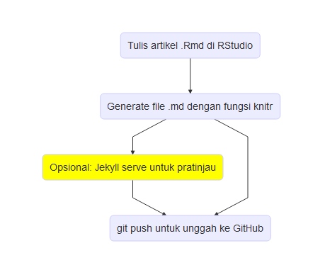
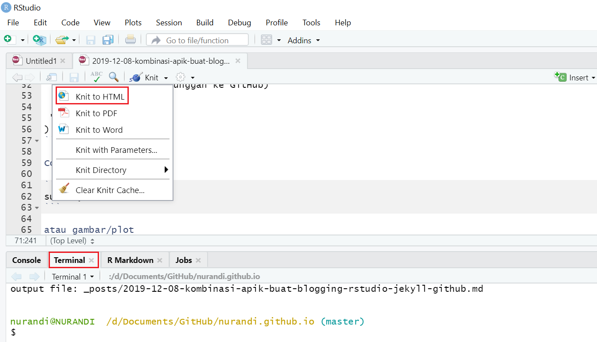

Sejak beralih dari Wordpress ke Jekyll dan GitHub beberapa tahun terakhir, alur untuk penulisan dan penerbitan artikel biasanya: menulis [file markdown](/blog/format-teks-dengan-markdown) di Notepad/[Notepad++](https://notepad-plus-plus.org/) &#8594; *jekyll serve* untuk *generate* blog sehingga bisa dilakukan pratinjau &#8594; jika sudah sesuai, *git push* ke GitHub untuk menerbitkan artikel. Tidak ada yang salah dengan *workflow* seperti ini. Hanya saja, saya sedikit "kerepotan" karena ada beberapa aplikasi yang harus saya buka secara bergantian, yaitu:

* Notepad/Notepad++ untuk menulis artikel dalam format markdown. Untuk artikel berisi koding R, saya juga menulis kode di RStudio, menjalankannya, lalu *copy-paste* kode dan outputnya ke dalam file markdown yang sedang saya tulis;
* [Bash/Ubuntu for Windows](/blog/apa-itu-jekyll-bagaimana-instalasinya-di-windows) untuk menjalankan Jekyll; dan
* [Git Bash](https://git-scm.com/) untuk *push* artikel ke GitHub.

Saya merasa proses tersebut bisa disederhanakan. 

Beruntung saya menemukan blog [David Robinson](http://varianceexplained.org/about/). Ia tidak menulis artikel pada file `*.md`, melainkan pada file [RMarkdown](https://rmarkdown.rstudio.com/) `*.Rmd`. File-file markdown sebagai *"core"* dari Jekyll, ia *generate* dengan [**knitr**](https://yihui.org/knitr/) -- salah satu fungsi di R. Dengan cara ini, kita bisa fokus membuat artikel, file `*.Rmd`, di RStudio. Pratinjau artikel bisa dilakukan dengan klik *icon Knit to HTML* di RStudio. Untuk *push* ke GitHub, kita bisa integrasikan *Git Bash* dengan RStudio *terminal*. Secara ringkas, alurnya dapat digambarkan:



Mari kita lihat detailnya satu per satu.

**1.** Tulis artikel dalam format RMarkdown `*.Rmd` di RStudio. Seluruh file RMarkdown saya simpan dalam satu folder tersendiri yaitu `_Rmd`. Jangan lupa untuk menuliskan YAML sebagaimana kita menuliskannya dalam file `*.md`. Apabila ingin melakukan pratinjau, klik ikon **Knit** lalu **Knit to HTML**. Meskipun HTML ini tidak mengunakan *layout* Jekyll, pratinjau ini bermanfaat untuk memeriksa penulisan.


  
Kelebihan menggunakan RMarkdown adalah jika dalam artikel kita terdapat kode R, maka kode dan outputnya dapat diatur apakah akan ditampilkan atau tidak. Sehingga tidak ada lagi proses *copy-paste*. Misalnya, *flowchart* di atas merupakan output dari kode R (yang disembunyikan). 

<pre><code>```{r, echo=FALSE}
library(DiagrammeR)
DiagrammeR("
  graph TB
  A(Tulis artikel .Rmd di RStudio)
   -->B(Generate file .md dengan fungsi knitr)
  B-->C(Opsional: Jekyll serve untuk pratinjau)
  C-->D(git push untuk unggah ke GitHub)
  B-->D
  style C fill:yellow
 "  
)
```</code></pre>

Contoh lain:  


```r
summary(cars)  
```

```
##      speed           dist       
##  Min.   : 4.0   Min.   :  2.00  
##  1st Qu.:12.0   1st Qu.: 26.00  
##  Median :15.0   Median : 36.00  
##  Mean   :15.4   Mean   : 42.98  
##  3rd Qu.:19.0   3rd Qu.: 56.00  
##  Max.   :25.0   Max.   :120.00
```

atau gambar/plot  


```r
plot(pressure)  
```


**2.** _Generate_ file `*.md`. Dengan menjalankan [**_scripts/knitpages.R**](https://github.com/nurandi/nurandi.github.io/blob/master/_scripts/knitpages.R) melalui perintah `Rscript _scripts/knitpage.R` di RStudio *terminal*, *file-file* `*.Rmd` pada folder `_Rmd` akan di-*knit* ke dalam format `*.md` di folder `_posts`. (`knitpage.R` saya sadur dari [github.com/dgrtwo](https://github.com/dgrtwo/dgrtwo.github.com/blob/master/_scripts/knitpages.R) dengan sedikit perubahan).

**3.** (Opsional) Jekyll serve untuk meng-*compile* blog dan _preview_. Bisa dilakukan apabila PC sudah terinstal Jekyll. Sangat bermanfaat untuk melihat tampilan sebenarnya sebelum artikel diterbitkan secara *online*. Saya sendiri menginstal Jekyll di Ubuntu for Windows. Sayangnya untuk menjalankan kita harus "keluar" dulu dari RStudio, buka Ubuntu, lalu ketikan perintah `bundle exec jekyll serve`. 

**4.** Langkah terakhir adalah *git push* ke GitHub untuk menerbitkan artikel. Apabila di PC sudah terinstal Git Bash, kita dapat menjalankan perintah berikut pada RStudio *terminal*;

```
git add .
git commit -m "publish new article with image"
git push
```

<mark>Sebenarnya</mark>, ada *workflow* yang lebih menarik untuk dicoba yaitu dengan menggunakan *package* [**blogdown**](https://bookdown.org/yihui/blogdown/). Sesuai dengan namanya, **blogdown** merupakan *R package* untuk membuat blog atau website dengan R. Menariknya, **blogdown** juga mendukung Jekyll. Hanya saja saya belum mencobanya. Mungkin nanti, kapan-kapan.


