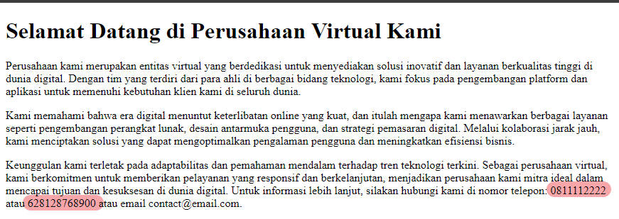
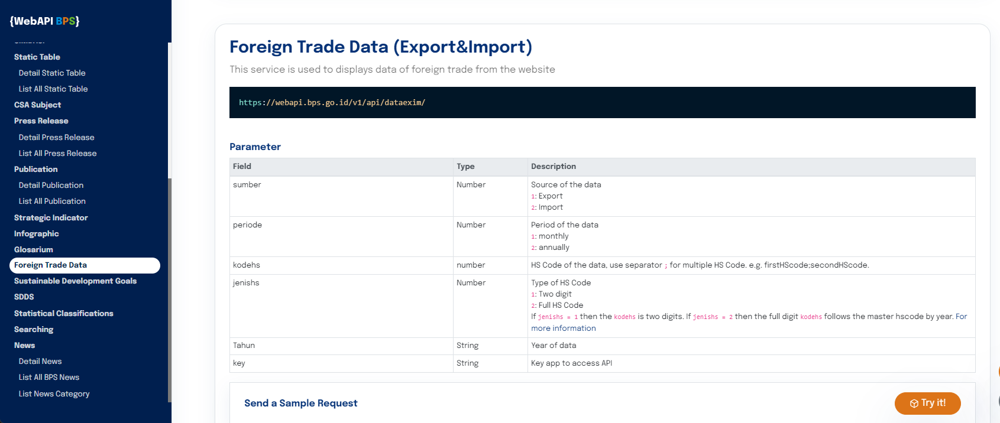
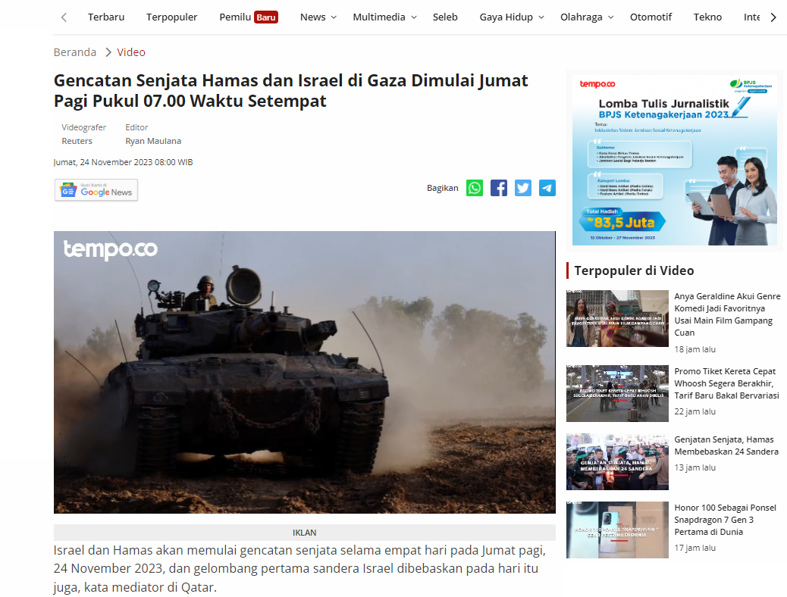

*Web scraping* adalah proses pengambilan data dari halaman web secara otomatis menggunakan kode atau perintah tertentu. Data yang diambil dapat berupa teks, gambar, atau format data lainnya. *Web scraping* dapat digunakan untuk berbagai tujuan, seperti mengumpulkan data untuk penelitian, analisis, atau pengembangan produk.

Teknik *web scraping* yang paling sering digunakan adalah dengan memanfaatkan **HTML parser** untuk mengakses dan memanipulasi DOM *(Document Object Model)* dari halaman HTML. DOM adalah representasi abstrak dari halaman HTML dalam bentuk objek. Setiap objek DOM mewakili elemen HTML, seperti tag, atribut, dan teks. HTML parser umumnya terdiri dari banyak fungsi untuk setiap tujuan yang spesifik. Misalnya kode `R` di bawah ini: fungsi `html_elements()` dari *package* `rvest` digunakan untuk mengambil semua elemen `h3` dengan `class=title`. Sementara `html_text()` digunakan untuk mengambil teks dari elemen tersebut. 


```r
library(rvest)

url <- "https://www.tempo.co/"
news_title <- url %>%
  read_html() %>%
  html_elements("h3.title") %>%
  html_text()
news_title 
```

```
## [1] "Genjatan Senjata, Hamas Membebaskan 24 Sandera"                                                                                                                                                                                                                                                                             
## [2] "Honor 100 Sebagai Ponsel Snapdragon 7 Gen 3 Pertama di Dunia"                                                                                                                                                                                                                                                               
## [3] "Anya Geraldine Akui Genre Komedi Jadi Favoritnya Usai Main Film Gampang Cuan"                                                                                                                                                                                                                                               
## [4] "Hadiri Hari Guru Nasional, Ini Pesan Presiden Jokowi untuk Mewujudkan Indonesia Maju"                                                                                                                                                                                                                                       
## [5] "Kisah Relawan Berikan Akses Pendidikan Bagi Anak-anak Pengungsi Rohingya "                                                                                                                                                                                                                                                  
## [6] "Promo Tiket Kereta Cepat Whoosh Segera Berakhir, Tarif Baru Bakal Bervariasi "                                                                                                                                                                                                                                              
## [7] "Calon presiden Ganjar Pranowo memberi nilai penegakan hukum di era Presiden Joko Widodo dengan skor 5 poin dari skala penilaian 1-10 imbas putusan Mahkamah Konstitusi soal usia capres-cawapres. Ganjar menyinggung adanya rekayasa dan intervensi. Apakah Anda setuju penegakan hukum di era Presiden Joko Widodo jeblok?"
## [8] "Menyesatkan, Video yang Mengklaim Kekuatan Militer Spanyol dan Irlandia Siap Tempur Melawan Israel "                                                                                                                                                                                                                        
## [9] "Anda punya data atau dokumen yang penting bagi publik? Kirimkan lewat tautan ini secara anonim."
```

Untuk lebih detail mengenai `rvest`, bisa lihat artikel sebelumnya di [sini](https://www.nurandi.id/blog/web-scraping-dengan-r-dan-rvest/) atau di [sini](https://www.nurandi.id/blog/web-scraping-dengan-r-dan-rvest-parsing-tabel-html/).

Selain menggunakan *HTML parser* ada teknik lain yang bisa dipilih tergantung dari bagaimana data yang akan diekstrak "ditulis" dalam website, yaitu:

1. Menggunakan regex
2. Melalui API resmi
3. Intercept XHR request
4. Ekstrak json dari source HTML

**PS:** Meskipun judulnya "...pada R", sebetulnya semua teknik ini bisa diterapkan pada bahasa pemrograman lain, seperti *Python*. Hanya penulisan kodenya saja yang perlu disesuaikan.

# *Regular Expression (Regex)*

*Regex* dapat digunakan untuk mengekstrak data dari HTML dengan cara mencocokkan pola tertentu. Teknik ini memang lebih rumit dibandingkan menggunakan parser, dan biasanya dipakai ketika data yang ingin kita ekstrak tidak berada pada objek DOM tertentu secara utuh. Misalnya, kita hendak mengambil nomor *handphone*  dari suatu teks, kita dapat menggunakan *regex* berikut. 

```
(0|62)8[1-9][0-9]{6,9}
```

Regex ini terdiri dari beberapa bagian, yaitu:

+ `(0|62)`: Bagian ini akan mencocokkan angka 0 atau 62, yang merupakan kode negara Indonesia.
+ `8[1-9]`: Bagian ini akan mencocokkan angka 8 diikuti oleh satu angka dari 1 hingga 9.
* `[0-9]{6,9}`: Bagian ini akan mencocokkan satu angka dari 0 hingga 9 yang diulang sebanyak 6 hingga 9 kali.

Contoh implementasi pada R:




```r
library(stringr)

readLines("https://virtual.tiiny.site/") %>%
  paste0(collapse = " ") %>%
  str_extract_all("(0|62)8[1-9][0-9]{6,9}")
```

```
## [[1]]
## [1] "0811112222"   "628128768900"
```

*Regex* sulit digunakan untuk pola yang kompleks sehingga biasanya menjadi pilihan terakhir yang dipakai untuk *scraping*. Meskipun demikian, *regex* sangat *powerful* sebagai alat untuk *data cleansing*. Lebih detail mengenai *regex* pada R, bisa pelajari artikel [ini](https://cran.r-project.org/web/packages/stringr/vignettes/regular-expressions.html)

# *Application Public Interface (API)*

*Web scraping* melalui *API (Application Programming Interface)* adalah pendekatan yang lebih terkontrol untuk mengekstrak data dari situs web dibandingkan dengan metode lainnya. Alih-alih mengakses langsung konten HTML dari situs web, cara ini melibatkan pembuatan permintaan *(request)* ke layanan web yang memberikan akses ke data dalam format terstruktur, seperti JSON atau XML. Umumnya, penyedia API juga menyediakan dokumentasi tentang aturan penggunaanya (terkait URL *end-point*, *query-string*, *header*, dan lain-lain) sehingga lebih mudah diimplementasikan oleh pihak ke-3. Layanan yang menyediakan API antara lain media sosial seperti [X/Twitter](https://developer.twitter.com/en) dan [Strava](https://developers.strava.com/) serta [Badan Pusat Statistik](https://webapi.bps.go.id/developer/). 



Sebagai contoh, kode ini melakukan permintaan data ekspor bulanan sepanjang tahun 2020 untuk kode HS 01 melalui WebAPI:


```r
library(jsonlite)
library(tibble)

url <- "https://webapi.bps.go.id/v1/api/dataexim/sumber/1/kodehs/01/jenishs/1/tahun/2020/periode/1/key/<BPS_APP_ID>/"
data <- fromJSON(url)

tibble(data$data)
```


```
## # A tibble: 294 × 7
##     value netweight kodehs              pod                ctr       tahun bulan
##     <dbl>     <dbl> <chr>               <chr>              <chr>     <chr> <chr>
##  1   8550      62   [01] Binatang hidup SOEKARNO-HATTA (U) AFGHANIS… 2020  [12]…
##  2    595      28   [01] Binatang hidup SOEKARNO-HATTA (U) ARMENIA   2020  [03]…
##  3    765      12   [01] Binatang hidup SOEKARNO-HATTA (U) ARMENIA   2020  [02]…
##  4    970       4   [01] Binatang hidup SOEKARNO-HATTA (U) AUSTRALIA 2020  [03]…
##  5    102      25   [01] Binatang hidup SOEKARNO-HATTA (U) AUSTRIA   2020  [10]…
##  6    146      32   [01] Binatang hidup SOEKARNO-HATTA (U) BAHRAIN   2020  [01]…
##  7  22300       9.5 [01] Binatang hidup NGURAH RAI (U)     BANGLADE… 2020  [11]…
##  8  25200      12   [01] Binatang hidup NGURAH RAI (U)     BANGLADE… 2020  [02]…
##  9 134320     252.  [01] Binatang hidup SOEKARNO-HATTA (U) BANGLADE… 2020  [12]…
## 10  20890     146.  [01] Binatang hidup SOEKARNO-HATTA (U) BANGLADE… 2020  [10]…
## # ℹ 284 more rows
```

# *Intercept XHR API*

Sebuah web yang memuat data secara dinamis biasanya menggunakan *XMLHttpRequests (XHRs) API* untuk berkomunikasi dan bertukar data dengan server tanpa perlu me-refresh halaman. Artinya, dengan memanfaatkan API tersebut, kita bisa mendapatkan data yang inginkan. Teknik ini sebetulnya sangat mirip dengan *scraping* melalui API yang dibahas sebelumnya. Hanya saja, kita perlu "menginspeksi" laman web untuk mengetahui struktur API tersebut (*end-point*, *query-string*, dan lain-lain). Misalnya, dari hasil *inspect* diketahui laman [pricebook](https://www.pricebook.co.id/tablet?brand=Samsung) memanggil API melalui URL:


```
https://gateway.pricebook.co.id/pb/category/product?category_id=42&brand=Samsung
```

untuk menampilkan daftar produk kategori Tablet dengan merk Samsung. Dengan mengubah nilai bagi `category_id` dan `brand` pada URL tersebut, kita bisa memperioleh list produk dari kategori dan merek lainnya.


```r
library(jsonlite)

url <- "https://gateway.pricebook.co.id/pb/category/product?category_id=42&brand=Samsung"
data <- fromJSON(url)
product <- data$result$product

tibble(product)
```

```
## # A tibble: 40 × 39
##    `_id`$`$id`            product_id category_id brand_id series_id product_name
##    <chr>                       <int>       <int>    <int>     <int> <chr>       
##  1 608bfed3be25e7f334741…      46142          42       92     16604 Galaxy Tab …
##  2 608bff13be25e7f33474a…      88362          42       92         0 Galaxy Tab …
##  3 608bff1abe25e7f33474b…      92990          42       92     34556 Galaxy Tab …
##  4 608bff09be25e7f334748…      81832          42       92         0 Galaxy Tab …
##  5 608bfeb9be25e7f33473c…      25430          42       92     16606 Galaxy Tab …
##  6 608bff0bbe25e7f334749…      82837          42       92         0 Galaxy Tab …
##  7 608bff0bbe25e7f334749…      82838          42       92         0 Galaxy Tab …
##  8 608bff11be25e7f33474a…      88050          42       92     34555 Galaxy Tab …
##  9 608bfee7be25e7f334743…      59191          42       92     16604 Galaxy Tab …
## 10 608bff1bbe25e7f33474b…      93994          42       92     35611 Galaxy Tab …
## # ℹ 30 more rows
## # ℹ 33 more variables: product_name_alias <chr>, category_name <chr>,
## #   category_alias <lgl>, brand_name <chr>, lowest_price <chr>,
## #   lowest_price_used <chr>, ranking_per_category <int>, rating <chr>,
## #   review_count <int>, forum_count <int>, shop_product_count <int>,
## #   shop_product_used_count <int>, primary <list>, filter <df[,3]>, ads <lgl>,
## #   image <chr>, image_media <chr>, image_raw <df[,2]>, …
```

# Ekstrak JSON dari HTML

Beberapa website menggunakan JSON *(JavaScript Object Notation)* untuk mengatur kontennya, baik berupa JSON-LD *(JSON for Linking Data)* atau sebagai *JavaScript variable*. JSON tersebut dapat ditemukan di *source HTML*. JSON-LD, misalnya, berada pada elemen `<script type="application/ld+json">` sehingga dengan memanfaatkan HTML parser, kita dapat mengekstrak data tersebut.




```r
library(rvest)
library(jsonlite)
library(stringr)

url <- "https://video.tempo.co/read/35926/gencatan-senjata-hamas-dan-israel-di-gaza-dimulai-jumat-pagi-pukul-07-00-waktu-setempat"
product <- read_html(url) %>% 
html_node(xpath = '//script[@type ="application/ld+json"]') %>% 
  html_text() %>%
  str_remove_all("\r\n") %>%
  fromJSON()

product$video
```

```
## $`@type`
## [1] "VideoObject"
## 
## $name
## [1] "Gencatan Senjata Hamas dan Israel di Gaza Dimulai Jumat Pagi Pukul 07.00 Waktu Setempat"
## 
## $contentUrl
## [1] "https://players.brightcove.net/3734026318001/default_default/index.html?videoId=x8pwl8g"
## 
## $thumbnailUrl
## [1] "https://statik.tempo.co/data/2023/11/24/id_1257265/1257265_720.jpg"
## 
## $description
## [1] "Israel dan Hamas akan memulai gencatan senjata selama empat hari pada Jumat pagi, 24 November 2023, dan gelombang pertama sandera Israel dibebaskan pada hari itu juga, kata mediator di Qatar. Perjanjian tersebut – yang pertama dalam perang brutal yang telah berlangsung hampir tujuh minggu – akan dimulai pada pukul 7 pagi waktu setempat (12.00 WIB) dan melibatkan gencatan senjata komprehensif di Gaza utara dan selatan, kata juru bicara Kementerian Luar Negeri Qatar. Foto: Reuters Editor: Ryan Maulana"
## 
## $uploadDate
## [1] "2023-11-24T08:00:00+07:00"
```
Dari output di atas, terlihat bahwa dengan mengekstraksi JSON-LD, kita dapat memperoleh beberapa informasi sekaligus. Hal ini tentu lebih sederhana dibandingkan dengan mengekstrak satu-per-satu element HTML.

--- 

Itulah beberapa teknik yang dapat digunakan untuk *scraping* website menggunakan R (atau tools lainnya). Teknik mana yang dipilih tentunya perlu disesuaikan dengan kondisi website. 

**PS:** *Semua gambar adalah hasil *screen-shot* pada 26 Nov 2013.*


