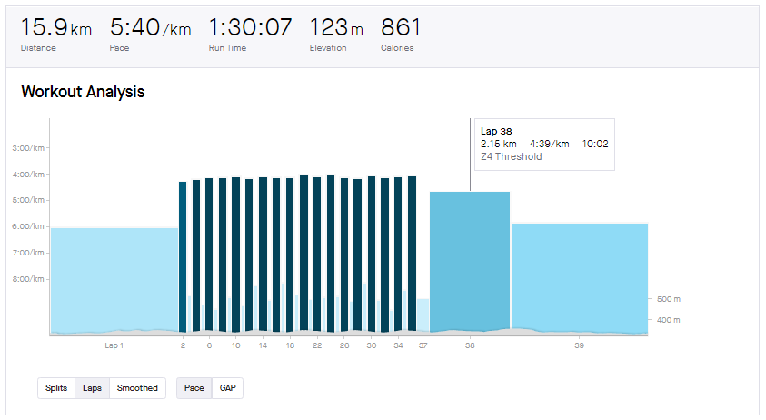

```{r setup, include=FALSE} 
knitr::opts_chunk$set(warning = FALSE, message = FALSE) 
```

Sebagai pelari, salah satu grafik favorit saya di Strava adalah *workout analysis* yang sangat berguna untuk mengevaluasi latihan kecepatan, seperti interval, tempo, *fartlek* dan sejenisnya. Grafik ini sebetulnya adalah diagram batang atau *bar chart* yang menampilkan *pace* (menit per kilometer) untuk setiap *split*/*lap*. Hanya saja, *bar chart* ini sedikit dimodifikasi sedemikian rupa, lebar dari batang bervariasi sesuai dengan panjang/pendeknya *split* (berdasarkan waktu atau jarak). Contohnya *workout analysis* dari salah satu [latihan](https://www.strava.com/activities/3197482313) dengan menu:

- 20 menit *warming-up*
- 18x 1 menit pada *pace* 5k dengan 1 menit *recovery*
- 3 menit *recovery*
- 10 menit tempo
- *cooling-down*

*Workout* tersebut digambarkan sangat apik oleh [Strava](https://www.strava.com/activities/3197482313/pace-analysis):



Saya tertarik membuat replikasi grafik tersebut menggunakan R dengan memanfaatkan paket populer `ggplot2` yang dipadukan dengan `plotly` agar menjadi interaktif. Karena Strava tidak menyediakan, saya *download* [*dataset*-nya](data/split.csv) dari Garmin Connect. Kebetulan saya menggunakan jam Garmin untuk merekam latihan saat itu.  

Pada `ggplot2`, jenis objek geometri (`geom`) yang cocok untuk menggambarkan chart ini adalah `geom_rect` yang berguna untuk membuat persegi panjang *(rectangle)* pada sebuah plot. Jenis geometri ini memerlukan titik koordinat sudut kiri bawah dan sudut kanan atas dari setiap persegi panjang.


## Persiapan data

Data `split` terdiri dari tiga kolom yaitu `Laps`, `Time` berformat H:M:S dan `Distance` dalam km.

```{r}
split <- read.csv("data/split.csv")
head(split)
```

Untuk membuat *chart*, saya membutuhkan beberapa variabel tambahan untuk setiap lap yang diturunkan dari ketiga variabel tersebut, yaitu:

* Batas bawah dan batas atas dari `Distance` untuk sumbu X, dan
* Batas bawah dan batas atas dari `Pace` atau waktu per km untuk sumbu Y.

Saya akan memanfaatkan `dplyr` untuk keperluan ini, dibantu oleh `lubridate` untuk mengelola kolom bertipe waktu.

```{r}
library(dplyr)
library(lubridate)

split <- split %>%
  arrange(Laps) %>%
  mutate(Cumulative_distance = cumsum(Distance),
         Distance_start = Cumulative_distance - Distance,
         Time_sec = period_to_seconds(ms(Time)),
         Pace_sec = Time_sec/Distance,
         Base_pace_sec = max(Pace_sec) + 30,
         Pace = format(as_datetime(Pace_sec),'%M:%S'))

head(split)
```

Saya sengaja menjadikan kolom waktu (`Time` dan `Pace`) dalam detik/*second*. Konversi detik menjadi waktu akan dikerjakan dalam `ggplot2`. Saya rasa ini lebih mudah. Atau ada pendapat lain?

## Buat *chart* dengan `ggplot2`

Dengan `ggplot2`, membuat *chart* **ala** Strava relatif simpel. Setelah inisiasi *layer* `ggplot`, cukup input kolom-kolom yang menjadi batas dalam `aes` pada `geom_rect`. `aes` dalam `ggplot` sebetulnya tidak diperlukan di sini, hanya saja akan berguna untuk menampilkan *tooltips* nanti. 

```{r}
library(ggplot2)

p <- ggplot(split, aes(label=Laps, label1=Distance, label2=Time, label3=Pace)) +
  geom_rect(
    aes(xmin=Distance_start, xmax=Cumulative_distance,
        ymin=as_datetime(Pace_sec), ymax=as_datetime(Base_pace_sec), 
        fill=Pace_sec), 
    colour="white") +
  scale_y_time(labels = function(t) strftime(t, "%M:%S"))  +
  theme(legend.position='none') +
  xlab("Distance (km)") +
  ylab("Pace (minutes/km)") +
  labs(title = "Running Analysis: 18 x 1 minute 5k pace + 10 minutes tempo") 

p
```

Nice, sudah terlihat bentuknya. 

Hanya saja, *axis-Y* perlu dibalik (*reverse*). Sebetulnya dulu saya berhasil membalik koordinat dari *axis-Y* seperti [ini](https://rpubs.com/nurandi/strava-chart) dengan trik dari [Stackoverflow](https://stackoverflow.com/a/43626186/3713478). Hanya saja, `gglot2` sepertinya tidak mendukung lagi. Jadi kali ini kita manfaatkan fungsi yang ada pada `gglotly` saja.

## Jadikan lebih interaktif dengan `plotly`

[**Plotly**](https://plotly.com/) adalah salah satu *library* untuk membuat grafik interaktif berbasis *JavaScript* yang mendukung berbagai bahasa pemrograman seperti R, Python, Julia, MATLAB, dan lain-lain. Dalam R, `plotly` "kompatibel" dengan `ggplot2`. Grafik statis yang dibuat dengan `ggplot2`, dapat dikonversi menjadi grafik `plotly` yang interaktif hanya dengan menggunakan perintah sederhana.

Kita coba konversikan plot `p` tadi dengan perintah berikut ini. 

```{r}
library(plotly)

ggplotly(p, tooltip = c("label", "label1", "label2", "label3")) %>%
  layout(yaxis = list(autorange = "reversed")) %>%
  config(displayModeBar = FALSE)
```


Taddaaa !!! *Split-chart* Strava ala-ala berhasil kita buat.

Perintah `ggplotly` berfungsi untuk mengkonversi grafik `ggplot` menjadi `plotly`. Hampir semua `geom_` dapat dikonversi menggunakan fungsi ini. `autorange = "reversed"` berfungsi untuk membalik titik koordinat. Sedangkan `tooltips` berguna untuk menampilkan *tooltips* atau data yang akan muncul ketika chart kita sorot dengan *mouse*. Kolom `label.?` sudah kita siapkan sebelumnya saat membuat `ggplot` tadi.

Semoga bermanfaat :)


