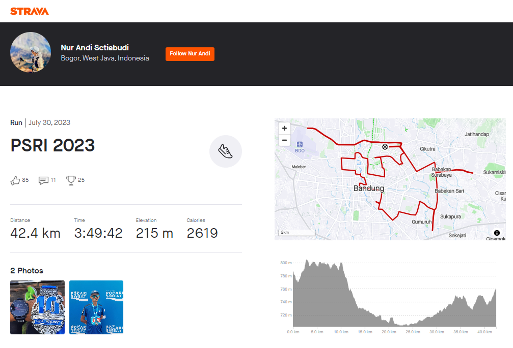

```{r setup, include=FALSE} 
knitr::opts_chunk$set(warning = FALSE, message = FALSE, out.width = "100%") 
```

*GPS eXchange*, atau disingkat GPX, merupakan format file untuk menyimpan dan bertukar data lintasan, rute dan lokasi. Kehadiran GPX menjadi krusial dalam merencanakan, melacak, dan merekam aktivitas *outdoor* seperti lari, bersepeda dan hiking dengan menyediakan data koordinat geografis yang dapat dieksplorasi untuk mendapatkan wawasan yang lebih mendalam terkait rute, jarak, dan elevasi. Dengan menggunakan R, kita dapat mengolah data GPX tersebut dan menghasilkan visualisasi yang informatif. Pada artikel ini akan dibahas bagaimana mengolah data GPX secara sederhana menggunakan R, yaitu  

* membaca file GPX
* menghitung jarak
* menghitung elevasi
* menampilkan peta dan profil elevasi



## Paket yang dibutuhkan

Beberapa paket yang dibutuhkan, antara lain:

* `sf` : salah satu *tools* untuk bekerja dengan data geospasial
* `dplyr` : untuk mengelola *dataframe*
* `ggplot2` : untuk visualisasi data termasuk membuat peta

*Install* (jika belum) dan *load* ketiga paket tersebut.

```{r eval=FALSE}
# jika belum terinstall
install.packages(c("sf", "dplyr", "ggplot2"))
```

```{r}
library(sf)
library(dplyr)
library(ggplot2)
```

## Membaca file GPX

GPX yang saya gunakan pada artikel ini direkam menggunakan *sport watch* pada lomba lari Pocari Sweat Run Indonesia 2023 di Bandung. File GPX bisa diunduh dari [Strava](https://www.strava.com/activities/9546800101) atau melalui link [ini](data/PSRI_2023.gpx).

Untuk membaca GPX, kita akan menggunakan paket `sf`. Kita harus memilih *layer* apa saja yang akan diambil. Untuk mengetahui layer yang tersedia, dapat memanggil fungsi `st_layers()`.


```{r}
GPX <- "data/PSRI_2023.gpx"

st_layers(GPX)
```
Selanjutnya, kita gunakan fungsi `st_read()` untuk membaca layer `track_points`.

```{r}
gpx_sf <- st_read(GPX, layer = "track_points", quiet = T)

class(gpx_sf)
glimpse(gpx_sf)
```

Kita peroleh objek dengan *class* `sf`, berupa *dataframe* dengan 27 kolom dan >13 ribu baris (titik koordinat). Jika diperhatikan, ada 3 kolom utama:

* `track_seg_point_id` yang merupakan ID,
* `eve` atau elevasi atau *altitude* dalam satuan mdpl (meter di atas permukaan laut),
* `geometry` yang ber-*class* `sfc_POINT`, menyimpan informasi koordinat.


# Menghitung total jarak dan elevasi

Total jarak dihitung dengan cara menjumlahkan jarak setiap titik koordinat ke titik koordinat berikutnya menggunakan fungsi `sf::st_distance()` dan `dplyr::lead()`. Agar hasil perhitungan lebih akurat, kita perlu *set* data spasial dengan *CRS (coordinate reference system)* 4326. CRS 4326, atau yang lebih lengkapnya EPSG:4326, adalah kode untuk *World Geodetic System* 1984 (WGS84), sistem referensi koodinat geografis global yang diwakili oleh pertemuan garis lintang dan bujur (derajat, menit, detik). CRS 4326 memanfaatkan model matematis yang memperhitungkan ketidakrataan bentuk bumi.

Perhitungan jarak dua titik yang berurutan menggunakan fungsi `st_distance()` dan `lead()` sedikit [*tricky*](https://github.com/r-spatial/sf/issues/799). Masalah ini disebabkan oleh fakta bahwa `sf` tidak menggunakan `NA` untuk koordinat yang hilang, melainkan dengan koordinat `EMPTY`. Sementara `lead()` secara *default* menggunakan `NA` untuk mengisi vektor. Untuk itu kita perlu menyiapkan titik `EMPTY` dengan CRS 4326 sebagai nilai *default* bagi fungsi `lead()`.

Perhitungan elevasi lebih sederhana, yaitu cukup dengan membandingkan elevasi dua titik yang berdekatan. Jika titik selanjutnya lebih tinggi, maka terjadi *gain* atau tanjakan Sementara jika titik selanjutnya lebih rendah, maka terjadi *loss* atau turunan.

Berikut *script* untuk menghitung total jarak dan elevasi (*gain* dan *loss*). Selain dengan paket `sf`, kita juga akan menggunakan beberapa fungsi dari paket `dplyr, seperti `mutate()` dan `select()`.

```{r}
empty <- st_as_sfc("POINT(EMPTY)", crs = 4326)

gpx_sf <- gpx_sf %>% 
  #  memilih kolom-kolom yang tidak semua nilainya `NA`
  select_if(~!all(is.na(.))) %>%
  st_set_crs(4326) %>% 
  mutate(
    distance_to_next = 
      st_distance(
        geometry, 
          lead(geometry, default = empty), 
        by_element = TRUE),
    distance = cumsum(distance_to_next),
    elevation_diff = lead(ele) - ele,
    elevation_gain = if_else(elevation_diff > 0,  elevation_diff, 0),
    elevation_loss = if_else(elevation_diff < 0, -elevation_diff, 0)
  ) %>%
  select(track_seg_point_id, 
         distance, 
         elevation = ele, 
         elevation_gain, 
         elevation_loss, 
         geometry)

glimpse(gpx_sf)
```

Selanjutnya, kita panggil fungsi `summarise` untuk menghitung total jarak serta total *elevation gain* dan *loss*.

```{r}
summary <- gpx_sf %>%
  replace(is.na(.), 0) %>% 
  summarise(distance = max(distance),
            elevation_gain = sum(elevation_gain),
            elevation_loss = sum(elevation_loss))

summary
```


## Menampilkan peta dan profil elevasi

Kita akan menggunakan `geom_sf()` dan `geom_ribbon()` dari `ggplot2()` untuk menampilkan peta rute dan profil elevasinya. 

### Peta rute

```{r}
map_route <- ggplot() + 
  geom_sf(data = gpx_sf$geometry, size = 0.2) + 
  geom_sf(data = head(gpx_sf$geometry,1), color = "red", size = 3) + 
  ggtitle("Pocari Sweat Run Indonesia 2023") +
  theme_minimal() +
  theme(plot.title = element_text(hjust = 0.5), axis.text=element_blank())

map_route
```

### Profil elevasi

```{r}
elevation_plot <- ggplot(data = gpx_sf, 
                            aes(as.numeric(distance)/1000, elevation)) +
  geom_ribbon(aes(ymin=min(elevation)-5, ymax=elevation), fill = "gray") +
  labs(title = "Elevation Profile: Pocari Sweat Run Indonesia 2023",
       x = "Distance (km)",
       y = "Altitude (m)") +
  theme_minimal() +
  theme(plot.title = element_text(hjust = 0.5))

elevation_plot
```

Nah, itulah cara sederhana mengolah data GPX menggunakan R untuk menghitung jarak, elevasi, dan membuat visualisasi peta dan profil elevasi guna mendapatkan wawasan yang lebih komprehensif tentang aktivitas *outdoor* yang akan atau telah dilakukan. Namun, perlu diingat bahwa data GPX mungkin saja tidak selalu akurat, terutama untuk elevasi. Selain itu, visualisasi yang dihasilkan juga bergantung pada pengaturan dan library yang digunakan. Tetap penting untuk melakukan penelitian dan verifikasi data sebelum mengambil keputusan berdasarkan hasil analisis.

Sebagai penutup, tentunya pengalaman berlari di Pocari Sweat Run Indonesia 2023 ini tidak hanya tentang jarak dan elevasi. Ada semangat, ada perjuangan, ada suasana kota yang dinikmati bersama. 

[**#hayulumpat**](#)


